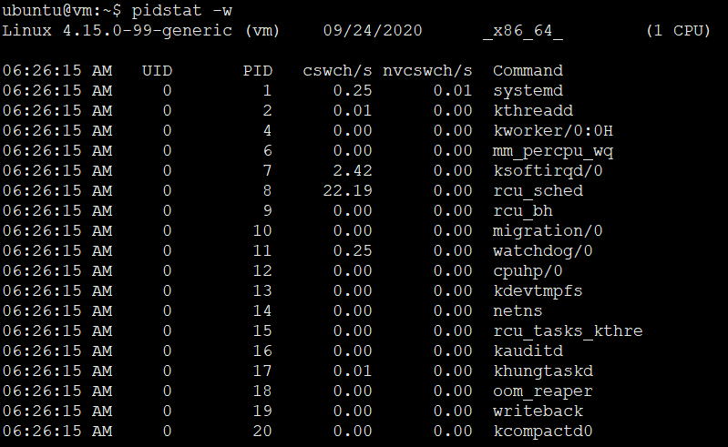
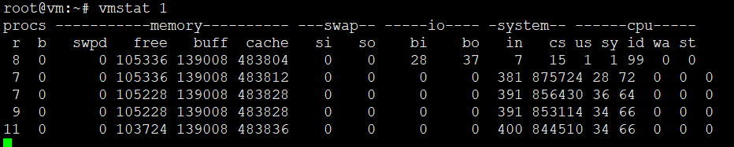
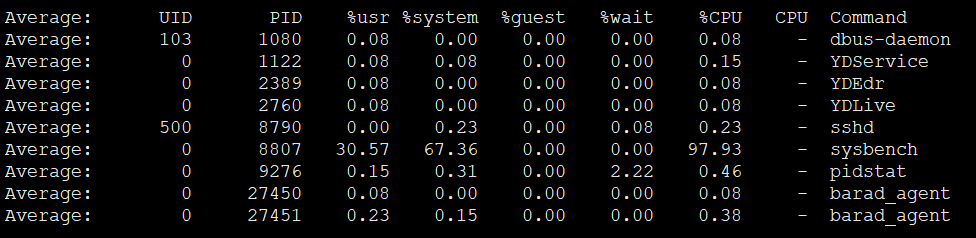
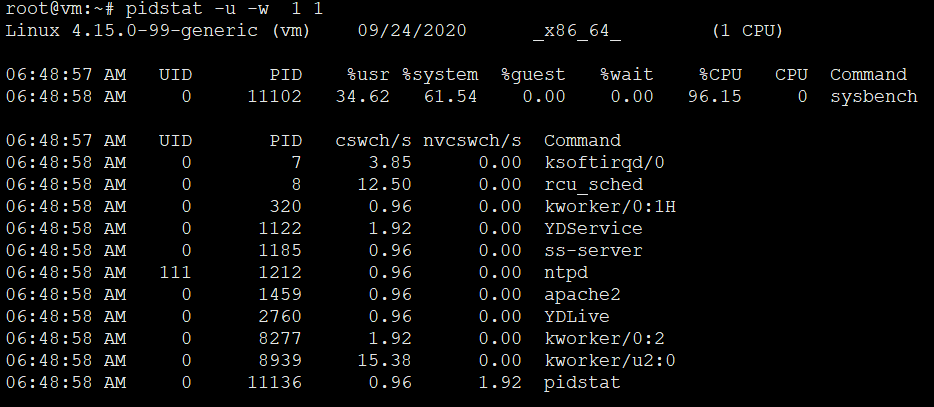
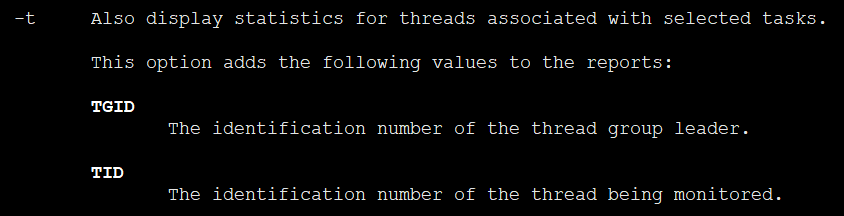
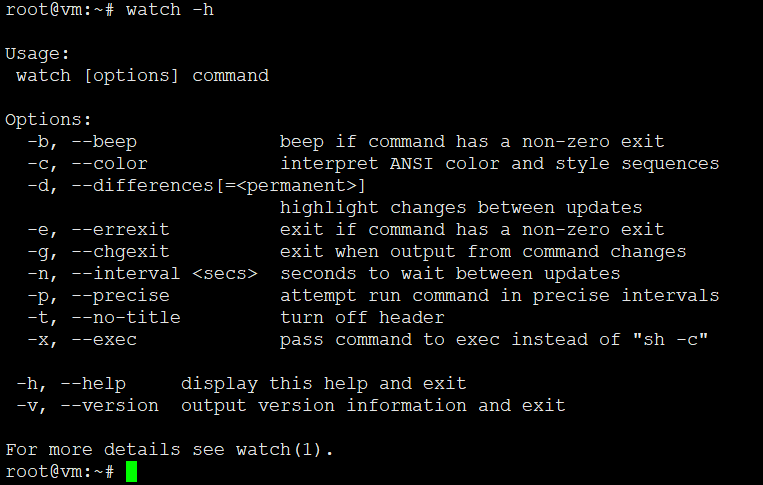

# 基础篇2-经常说的CPU上下文切换是什么意思

CPU 上下文切换是保证 Linux 系统正常工作的一个核心功能，按照不同场景，可以分为**进程上下文切换**、**线程上下文切换**和**中断上下文切换**。具体的概念和区别，你也要在脑海中过一遍，忘了的话及时查看上一篇。

今天我们就接着来看，究竟怎么分析 CPU 上下文切换的问题。

## 怎么查看系统的上下文切换情况

通过前面学习我们知道，**过多的上下文切换，会把 CPU 时间消耗在寄存器、内核栈以及虚拟内存等数据的保存和恢复上，缩短进程真正运行的时间，成了系统性能大幅下降的一个元凶**。

既然上下文切换对系统性能影响那么大，你肯定迫不及待想知道，到底要怎么查看上下文切换呢？在这里，我们可以使用 vmstat 这个工具，来查询系统的上下文切换情况。

**vmstat 是一个常用的系统性能分析工具，主要用来分析系统的内存使用情况，也常用来分析 CPU 上下文切换和中断的次数**。

比如，下面就是一个 vmstat 的使用示例：


```
Usage:
 vmstat [options] [delay [count]]

Options:
 -a, --active           active/inactive memory
 -f, --forks            number of forks since boot
 -m, --slabs            slabinfo
 -n, --one-header       do not redisplay header
 -s, --stats            event counter statistics
 -d, --disk             disk statistics
 -D, --disk-sum         summarize disk statistics
 -p, --partition <dev>  partition specific statistics
 -S, --unit <char>      define display unit
 -w, --wide             wide output
 -t, --timestamp        show timestamp

 -h, --help     display this help and exit
 -V, --version  output version information and exit

```


```
# 每隔5秒输出1组数据
$ vmstat 5
procs -----------memory---------- ---swap-- -----io---- -system-- ------cpu-----
 r  b   swpd   free   buff  cache   si   so    bi    bo   in   cs us sy id wa st
 0  0      0 7005360  91564 818900    0    0     0     0   25   33  0  0 100  0  0
```


我们一起来看这个结果，你可以先试着自己解读每列的含义。在这里，我重点强调下，需要特别关注的四列内容：

* cs（context switch）是每秒上下文切换的次数。
* in（interrupt）则是每秒中断的次数。
* r（Running or Runnable）是就绪队列的长度，也就是正在运行和等待 CPU 的进程数。
* b（Blocked）则是处于不可中断睡眠状态的进程数。

可以看到，这个例子中的上下文切换次数 cs 是 33 次，而系统中断次数 in 则是 25 次，而就绪队列长度 r 和不可中断状态进程数 b 都是 0。

**vmstat 只给出了系统总体的上下文切换情况，要想查看每个进程的详细情况，就需要使用我们前面提到过的 pidstat **了。给它加上 -w 选项，你就可以查看每个进程上下文切换的情况了。



这个结果中有两列内容是我们的重点关注对象。一个是 cswch ，表示每秒自愿上下文切换（voluntary context switches）的次数，另一个则是 nvcswch ，表示每秒非自愿上下文切换（non voluntary context switches）的次数。

这两个概念你一定要牢牢记住，因为它们意味着不同的性能问题：

1. 所谓自愿上下文切换，是指进程无法获取所需资源，导致的上下文切换。比如说， I/O、内存等系统资源不足时，就会发生自愿上下文切换。
2. 而非自愿上下文切换，则是指进程由于时间片已到等原因，被系统强制调度，进而发生的上下文切换。比如说，大量进程都在争抢 CPU 时，就容易发生非自愿上下文切换。

## 案例分析

知道了怎么查看这些指标，另一个问题又来了，上下文切换频率是多少次才算正常呢？别急着要答案，同样的，我们先来看一个上下文切换的案例。通过案例实战演练，你自己就可以分析并找出这个标准了。


## 你的准备

今天的案例，我们将使用 sysbench 来模拟系统多线程调度切换的情况。

sysbench 是一个多线程的基准测试工具，一般用来评估不同系统参数下的数据库负载情况。当然，在这次案例中，我们只把它当成一个异常进程来看，作用是模拟上下文切换过多的问题。

下面的案例基于 Ubuntu 18.04，当然，其他的 Linux 系统同样适用。我使用的案例环境如下所示：

1. 机器配置：2 CPU，8GB 内存
2. 预先安装 sysbench 和 sysstat 包，如 apt install sysbench sysstat

正式操作开始前，你需要打开三个终端，登录到同一台 Linux 机器中，并安装好上面提到的两个软件包。

```
sudo apt-get install -y sysbench sysstat
```

另外注意，下面所有命令，都默认以 root 用户运行。所以，如果你是用普通用户登陆的系统，记住先运行 sudo su root 命令切换到 root 用户。

安装完成后，你可以先用 vmstat 看一下空闲系统的上下文切换次数：

```
vmstat [options] [delay [count]]
```

```
# 间隔1秒后输出1组数据
$ vmstat 1 1
procs -----------memory---------- ---swap-- -----io---- -system-- ------cpu-----
 r  b   swpd   free   buff  cache   si   so    bi    bo   in   cs us sy id wa st
 0  0      0 6984064  92668 830896    0    0     2    19   19   35  1  0 99  0  0
```

这里你可以看到，现在的上下文切换次数 cs 是 35，而中断次数 in 是 19，r 和 b 都是 0。因为这会儿我并没有运行其他任务，所以它们就是空闲系统的上下文切换次数。

## 操作和分析

接下来，我们正式进入实战操作。

首先，在第一个终端里运行 sysbench ，模拟系统多线程调度的瓶颈：

```
# 以10个线程运行5分钟的基准测试，模拟多线程切换的问题
$ sysbench --threads=10 --max-time=300 threads run
```

接着，在第二个终端运行 vmstat ，观察上下文切换情况：



你应该可以发现，cs 列的上下文切换次数从之前的 35 骤然上升到了 139 万。同时，注意观察其他几个指标：

```
# 每隔1秒输出1组数据（需要Ctrl+C才结束）
$ vmstat 1
procs -----------memory---------- ---swap-- -----io---- -system-- ------cpu-----
 r  b   swpd   free   buff  cache   si   so    bi    bo   in   cs us sy id wa st
 6  0      0 6487428 118240 1292772    0    0     0     0 9019 1398830 16 84  0  0  0
 8  0      0 6487428 118240 1292772    0    0     0     0 10191 1392312 16 84  0  0  0
```

你应该可以发现，cs 列的上下文切换次数从之前的 35 骤然上升到了 139 万。同时，注意观察其他几个指标：

* r 列：就绪队列的长度已经到了 8，远远超过了系统 CPU 的个数 2，所以肯定会有大量的 CPU 竞争。
* us（user）和 sy（system）列：这两列的 CPU 使用率加起来上升到了 100%，其中系统 CPU 使用率，也就是 sy 列高达 84%，说明 CPU 主要是被内核占用了。
* in 列：中断次数也上升到了 1 万左右，说明中断处理也是个潜在的问题。

综合这几个指标，我们可以知道，**系统的就绪队列过长，也就是正在运行和等待 CPU 的进程数过多，导致了大量的上下文切换，而上下文切换又导致了系统 CPU 的占用率升高**。

那么到底是什么进程导致了这些问题呢？

我们继续分析，在第三个终端再用 pidstat 来看一下， CPU 和进程上下文切换的情况：

```
# 每隔1秒输出1组数据（需要 Ctrl+C 才结束）
# -w参数表示输出进程切换指标，而-u参数则表示输出CPU使用指标
$ pidstat -w -u 1
08:06:33      UID       PID    %usr %system  %guest   %wait    %CPU   CPU  Command
08:06:34        0     10488   30.00  100.00    0.00    0.00  100.00     0  sysbench
08:06:34        0     26326    0.00    1.00    0.00    0.00    1.00     0  kworker/u4:2

08:06:33      UID       PID   cswch/s nvcswch/s  Command
08:06:34        0         8     11.00      0.00  rcu_sched
08:06:34        0        16      1.00      0.00  ksoftirqd/1
08:06:34        0       471      1.00      0.00  hv_balloon
08:06:34        0      1230      1.00      0.00  iscsid
08:06:34        0      4089      1.00      0.00  kworker/1:5
08:06:34        0      4333      1.00      0.00  kworker/0:3
08:06:34        0     10499      1.00    224.00  pidstat
08:06:34        0     26326    236.00      0.00  kworker/u4:2
08:06:34     1000     26784    223.00      0.00  sshd
```

```
# 每隔1秒输出1组数据（需要 Ctrl+C 才结束）
# -w参数表示输出进程切换指标，而-u参数则表示输出CPU使用指标
$ pidstat -w -u 1
08:06:33      UID       PID    %usr %system  %guest   %wait    %CPU   CPU  Command
08:06:34        0     10488   30.00  100.00    0.00    0.00  100.00     0  sysbench
08:06:34        0     26326    0.00    1.00    0.00    0.00    1.00     0  kworker/u4:2

08:06:33      UID       PID   cswch/s nvcswch/s  Command
08:06:34        0         8     11.00      0.00  rcu_sched
08:06:34        0        16      1.00      0.00  ksoftirqd/1
08:06:34        0       471      1.00      0.00  hv_balloon
08:06:34        0      1230      1.00      0.00  iscsid
08:06:34        0      4089      1.00      0.00  kworker/1:5
08:06:34        0      4333      1.00      0.00  kworker/0:3
08:06:34        0     10499      1.00    224.00  pidstat
08:06:34        0     26326    236.00      0.00  kworker/u4:2
08:06:34     1000     26784    223.00      0.00  sshd
```



从 pidstat 的输出你可以发现，CPU 使用率的升高果然是 sysbench 导致的，它的 CPU 使用率已经达到了 100%。但上下文切换则是来自其他进程，包括非自愿上下文切换频率最高的 pidstat ，以及自愿上下文切换频率最高的内核线程 kworker 和 sshd。

不过，细心的你肯定也发现了一个怪异的事儿：pidstat 输出的上下文切换次数，加起来也就几百，比 vmstat 的 139 万明显小了太多。这是怎么回事呢？难道是工具本身出了错吗？



别着急，在怀疑工具之前，我们再来回想一下，前面讲到的几种上下文切换场景。其中有一点提到， Linux 调度的基本单位实际上是线程，而我们的场景 sysbench 模拟的也是线程的调度问题，那么，是不是 pidstat 忽略了线程的数据呢？

通过运行 man pidstat ，你会发现，**pidstat 默认显示进程的指标数据，加上 -t 参数后，才会输出线程的指标。**



```
root@vm:~# pidstat -u -w -t  1 1
Linux 4.15.0-99-generic (vm) 	09/24/2020 	_x86_64_	(1 CPU)

06:50:15 AM   UID      TGID       TID    %usr %system  %guest   %wait    %CPU   CPU  Command
06:50:16 AM     0         -      2392    0.87    0.00    0.00    0.00    0.87     0  |__YDService
06:50:16 AM     0     11102         -   25.22   68.70    0.00    0.00   93.91     0  sysbench
06:50:16 AM     0         -     11103    2.61    6.09    0.00   67.83    8.70     0  |__sysbench
06:50:16 AM     0         -     11104    3.48    5.22    0.00   63.48    8.70     0  |__sysbench
06:50:16 AM     0         -     11105    1.74    7.83    0.00   64.35    9.57     0  |__sysbench
06:50:16 AM     0         -     11106    2.61    6.96    0.00   66.09    9.57     0  |__sysbench
06:50:16 AM     0         -     11107    2.61    6.96    0.00   66.09    9.57     0  |__sysbench
06:50:16 AM     0         -     11108    1.74    7.83    0.00   64.35    9.57     0  |__sysbench
06:50:16 AM     0         -     11109    3.48    6.09    0.00   67.83    9.57     0  |__sysbench
06:50:16 AM     0         -     11110    1.74    7.83    0.00   66.96    9.57     0  |__sysbench
06:50:16 AM     0         -     11111    3.48    5.22    0.00   66.96    8.70     0  |__sysbench
06:50:16 AM     0         -     11112    2.61    7.83    0.00   71.30   10.43     0  |__sysbench
06:50:16 AM     0     11337         -    0.00    1.74    0.00   10.43    1.74     0  pidstat
06:50:16 AM     0         -     11337    0.00    1.74    0.00   10.43    1.74     0  |__pidstat

06:50:15 AM   UID      TGID       TID   cswch/s nvcswch/s  Command
06:50:16 AM     0         7         -      9.57      0.00  ksoftirqd/0
06:50:16 AM     0         -         7      9.57      0.00  |__ksoftirqd/0
06:50:16 AM     0         8         -     38.26      0.00  rcu_sched
06:50:16 AM     0         -         8     38.26      0.00  |__rcu_sched
06:50:16 AM     0         -      1170      5.22      0.00  |__YDService
06:50:16 AM     0         -      1579      3.48      0.00  |__YDService
06:50:16 AM     0         -      1580     10.43      0.00  |__YDService
06:50:16 AM     0         -      1581      0.87      0.00  |__YDService
06:50:16 AM     0         -      1611      3.48      0.00  |__YDService
06:50:16 AM     0         -      2132      9.57      0.00  |__YDService
06:50:16 AM     0         -      2133      0.87      0.00  |__YDService
06:50:16 AM     0         -      2382      9.57      0.00  |__YDService
06:50:16 AM     0         -      2383      9.57      0.00  |__YDService
06:50:16 AM     0         -      2384      0.87      0.00  |__YDService
06:50:16 AM     0         -      2386      0.87      0.00  |__YDService
06:50:16 AM     0         -      2387      0.87      0.00  |__YDService
06:50:16 AM     0         -      2392      0.87      0.00  |__YDService
06:50:16 AM     0         -      2431      7.83      0.00  |__YDService
06:50:16 AM     0         -      3706      3.48      0.00  |__YDService
06:50:16 AM     0      1185         -      1.74      0.00  ss-server
06:50:16 AM     0         -      1185      1.74      0.00  |__ss-server
06:50:16 AM     0         -      1405     15.65      0.00  |__containerd
06:50:16 AM     0         -      1406      5.22     16.52  |__containerd
06:50:16 AM     0         -      1583      6.09      0.00  |__containerd
06:50:16 AM   111      1212         -      0.87      0.00  ntpd
06:50:16 AM   111         -      1212      0.87      0.00  |__ntpd
06:50:16 AM     0      1459         -      0.87      0.00  apache2
06:50:16 AM     0         -      1459      0.87      0.00  |__apache2
06:50:16 AM     0         -      2390      1.74      0.00  |__YDEdr
06:50:16 AM     0         -      2391      7.83      0.00  |__YDEdr
06:50:16 AM     0         -      2393      0.87      0.00  |__YDEdr
06:50:16 AM     0         -      2397      2.61      0.00  |__YDEdr
06:50:16 AM     0         -      2398      2.61      0.00  |__YDEdr
06:50:16 AM     0         -      2399      2.61      0.00  |__YDEdr
06:50:16 AM     0      2760         -      0.87      0.00  YDLive
06:50:16 AM     0         -      2760      0.87      0.00  |__YDLive
06:50:16 AM     0         -      2777      0.87      0.00  |__YDLive
06:50:16 AM     0      2761         -      0.87      0.00  sendmail-mta
06:50:16 AM     0         -      2761      0.87      0.00  |__sendmail-mta
06:50:16 AM     0      8277         -      1.74      0.00  kworker/0:2
06:50:16 AM     0         -      8277      1.74      0.00  |__kworker/0:2
06:50:16 AM     0         -     11103  10927.83  66539.13  |__sysbench
06:50:16 AM     0         -     11104  12880.00  66373.91  |__sysbench
06:50:16 AM     0         -     11105  11015.65  69432.17  |__sysbench
06:50:16 AM     0         -     11106  10982.61  68172.17  |__sysbench
06:50:16 AM     0         -     11107  12057.39  67926.09  |__sysbench
06:50:16 AM     0         -     11108  12406.96  67404.35  |__sysbench
06:50:16 AM     0         -     11109   9954.78  74046.09  |__sysbench
06:50:16 AM     0         -     11110  11417.39  69026.96  |__sysbench
06:50:16 AM     0         -     11111  11726.09  71388.70  |__sysbench
06:50:16 AM     0         -     11112   7858.26  76704.35  |__sysbench
06:50:16 AM     0     11337         -      0.87      5.22  pidstat
06:50:16 AM     0         -     11337      0.87      5.22  |__pidstat
06:50:16 AM     0     27450         -      2.61      0.87  barad_agent
06:50:16 AM     0         -     27450      2.61      0.87  |__barad_agent
06:50:16 AM     0         -     27478     25.22      0.00  |__barad_agent
06:50:16 AM     0         -     27493      1.74      0.00  |__barad_agent
06:50:16 AM     0         -     11338     17.39      4.35  |__barad_agent
06:50:16 AM     0     29377         -     12.17      0.00  kworker/u2:3
06:50:16 AM     0         -     29377     12.17      0.00  |__kworker/u2:3

Average:      UID      TGID       TID    %usr %system  %guest   %wait    %CPU   CPU  Command
Average:        0         -      2392    0.87    0.00    0.00    0.00    0.87     -  |__YDService
Average:        0     11102         -   25.22   68.70    0.00    0.00   93.91     -  sysbench
Average:        0         -     11103    2.61    6.09    0.00   67.83    8.70     -  |__sysbench
Average:        0         -     11104    3.48    5.22    0.00   63.48    8.70     -  |__sysbench
Average:        0         -     11105    1.74    7.83    0.00   64.35    9.57     -  |__sysbench
Average:        0         -     11106    2.61    6.96    0.00   66.09    9.57     -  |__sysbench
Average:        0         -     11107    2.61    6.96    0.00   66.09    9.57     -  |__sysbench
Average:        0         -     11108    1.74    7.83    0.00   64.35    9.57     -  |__sysbench
Average:        0         -     11109    3.48    6.09    0.00   67.83    9.57     -  |__sysbench
Average:        0         -     11110    1.74    7.83    0.00   66.96    9.57     -  |__sysbench
Average:        0         -     11111    3.48    5.22    0.00   66.96    8.70     -  |__sysbench
Average:        0         -     11112    2.61    7.83    0.00   71.30   10.43     -  |__sysbench
Average:        0     11337         -    0.00    1.74    0.00   10.43    1.74     -  pidstat
Average:        0         -     11337    0.00    1.74    0.00   10.43    1.74     -  |__pidstat

Average:      UID      TGID       TID   cswch/s nvcswch/s  Command
Average:        0         7         -      9.57      0.00  ksoftirqd/0
Average:        0         -         7      9.57      0.00  |__ksoftirqd/0
Average:        0         8         -     38.26      0.00  rcu_sched
Average:        0         -         8     38.26      0.00  |__rcu_sched
Average:        0         -      1170      5.22      0.00  |__YDService
Average:        0         -      1579      3.48      0.00  |__YDService
Average:        0         -      1580     10.43      0.00  |__YDService
Average:        0         -      1581      0.87      0.00  |__YDService
Average:        0         -      1611      3.48      0.00  |__YDService
Average:        0         -      2132      9.57      0.00  |__YDService
Average:        0         -      2133      0.87      0.00  |__YDService
Average:        0         -      2382      9.57      0.00  |__YDService
Average:        0         -      2383      9.57      0.00  |__YDService
Average:        0         -      2384      0.87      0.00  |__YDService
Average:        0         -      2386      0.87      0.00  |__YDService
Average:        0         -      2387      0.87      0.00  |__YDService
Average:        0         -      2392      0.87      0.00  |__YDService
Average:        0         -      2431      7.83      0.00  |__YDService
Average:        0         -      3706      3.48      0.00  |__YDService
Average:        0      1185         -      1.74      0.00  ss-server
Average:        0         -      1185      1.74      0.00  |__ss-server
Average:        0         -      1405     15.65      0.00  |__containerd
Average:        0         -      1406      5.22     16.52  |__containerd
Average:        0         -      1583      6.09      0.00  |__containerd
Average:      111      1212         -      0.87      0.00  ntpd
Average:      111         -      1212      0.87      0.00  |__ntpd
Average:        0      1459         -      0.87      0.00  apache2
Average:        0         -      1459      0.87      0.00  |__apache2
Average:        0         -      2390      1.74      0.00  |__YDEdr
Average:        0         -      2391      7.83      0.00  |__YDEdr
Average:        0         -      2393      0.87      0.00  |__YDEdr
Average:        0         -      2397      2.61      0.00  |__YDEdr
Average:        0         -      2398      2.61      0.00  |__YDEdr
Average:        0         -      2399      2.61      0.00  |__YDEdr
Average:        0      2760         -      0.87      0.00  YDLive
Average:        0         -      2760      0.87      0.00  |__YDLive
Average:        0         -      2777      0.87      0.00  |__YDLive
Average:        0      2761         -      0.87      0.00  sendmail-mta
Average:        0         -      2761      0.87      0.00  |__sendmail-mta
Average:        0      8277         -      1.74      0.00  kworker/0:2
Average:        0         -      8277      1.74      0.00  |__kworker/0:2
Average:        0         -     11103  10927.83  66539.13  |__sysbench
Average:        0         -     11104  12880.00  66373.91  |__sysbench
Average:        0         -     11105  11015.65  69432.17  |__sysbench
Average:        0         -     11106  10982.61  68172.17  |__sysbench
Average:        0         -     11107  12057.39  67926.09  |__sysbench
Average:        0         -     11108  12406.96  67404.35  |__sysbench
Average:        0         -     11109   9954.78  74046.09  |__sysbench
Average:        0         -     11110  11417.39  69026.96  |__sysbench
Average:        0         -     11111  11726.09  71388.70  |__sysbench
Average:        0         -     11112   7858.26  76704.35  |__sysbench
Average:        0     11337         -      0.87      5.22  pidstat
Average:        0         -     11337      0.87      5.22  |__pidstat
Average:        0     27450         -      2.61      0.87  barad_agent
Average:        0         -     27450      2.61      0.87  |__barad_agent
Average:        0         -     27478     25.22      0.00  |__barad_agent
Average:        0         -     27493      1.74      0.00  |__barad_agent
Average:        0         -     11338     17.39      4.35  |__barad_agent
Average:        0     29377         -     12.17      0.00  kworker/u2:3
Average:        0         -     29377     12.17      0.00  |__kworker/u2:3
```

所以，我们可以在第三个终端里， Ctrl+C 停止刚才的 pidstat 命令，再加上 -t 参数，重试一下看看：

```
# 每隔1秒输出一组数据（需要 Ctrl+C 才结束）
# -wt 参数表示输出线程的上下文切换指标
$ pidstat -wt 1
08:14:05      UID      TGID       TID   cswch/s nvcswch/s  Command
...
08:14:05        0     10551         -      6.00      0.00  sysbench
08:14:05        0         -     10551      6.00      0.00  |__sysbench
08:14:05        0         -     10552  18911.00 103740.00  |__sysbench
08:14:05        0         -     10553  18915.00 100955.00  |__sysbench
08:14:05        0         -     10554  18827.00 103954.00  |__sysbench
...
```

现在你就能看到了，虽然 sysbench 进程（也就是主线程）的上下文切换次数看起来并不多，但它的子线程的上下文切换次数却有很多。看来，上下文切换罪魁祸首，还是过多的 sysbench 线程。

我们已经找到了上下文切换次数增多的根源，那是不是到这儿就可以结束了呢？

当然不是。不知道你还记不记得，前面在观察系统指标时，除了上下文切换频率骤然升高，还有一个指标也有很大的变化。是的，正是中断次数。中断次数也上升到了 1 万，但到底是什么类型的中断上升了，现在还不清楚。我们接下来继续抽丝剥茧找源头。

既然是中断，我们都知道，它只发生在内核态，而 pidstat 只是一个进程的性能分析工具，并不提供任何关于中断的详细信息，怎样才能知道中断发生的类型呢？

没错，那就是从 /proc/interrupts 这个只读文件中读取。/proc 实际上是 Linux 的一个虚拟文件系统，用于内核空间与用户空间之间的通信。/proc/interrupts 就是这种通信机制的一部分，提供了一个只读的中断使用情况。

我们还是在第三个终端里， Ctrl+C 停止刚才的 pidstat 命令，然后运行下面的命令，观察中断的变化情况：



```
# -d 参数表示高亮显示变化的区域
$ watch -d cat /proc/interrupts
           CPU0       CPU1
...
RES:    2450431    5279697   Rescheduling interrupts
...
```

观察一段时间，你可以发现，变化速度最快的是**重(chong)调度中断（RES）**，这个中断类型表示，唤醒空闲状态的 CPU 来调度新的任务运行。这是多处理器系统（SMP）中，调度器用来分散任务到不同 CPU 的机制，通常也被称为**处理器间中断（Inter-Processor Interrupts，IPI）**。

所以，这里的中断升高还是因为过多任务的调度问题，跟前面上下文切换次数的分析结果是一致的。

通过这个案例，你应该也发现了多工具、多方面指标对比观测的好处。如果最开始时，我们只用了 pidstat 观测，这些很严重的上下文切换线程，压根儿就发现不了了。

现在再回到最初的问题，每秒上下文切换多少次才算正常呢？

这个**数值其实取决于系统本身的 CPU 性能**。在我看来，如果系统的上下文切换次数比较稳定，那么从数百到一万以内，都应该算是正常的。但当上下文切换次数超过一万次，或者切换次数出现数量级的增长时，就很可能已经出现了性能问题。


这时，你还需要根据上下文切换的类型，再做具体分析。比方说：

1. 自愿上下文切换变多了，说明进程都在等待资源，有可能发生了 I/O 等其他问题；
2. 非自愿上下文切换变多了，说明进程都在被强制调度，也就是都在争抢 CPU，说明 CPU 的确成了瓶颈；
3. 中断次数变多了，说明 CPU 被中断处理程序占用，还需要通过查看 /proc/interrupts 文件来分析具体的中断类型。

## 小结

最后，我想请你一起来聊聊，你之前是怎么分析和排查上下文切换问题的。你可以结合这两节的内容和你自己的实际操作，来总结自己的思路。


## 总结

1. 首先通过uptime查看系统负载，然后使用mpstat结合pidstat来初步判断到底是cpu计算量大还是进程争抢过大或者是io过多，接着使用vmstat分析切换次数，以及切换类型，来进一步判断到底是io过多导致问题还是进程争抢激烈导致问题


登录到服务器，现在系统负载怎么样 。 高的话有三种情况，首先是cpu使用率 ，其次是io使用率 ，之后就是两者都高 。

cpu 使用率高，可能确实是使用率高， 也的可能实际处理不高而是进程太多切换上下文频繁 ， 也可能是进程内线程的上下文切换频繁

io 使用率高 ， 说明 io 请求比较大， 可能是 文件io 、 网络io 。

工具 ：
系统负载 ： uptime （ watch -d uptime）看三个阶段平均负载
系统整体情况 ： mpstat （mpstat -p ALL 3） 查看 每个cpu当前的整体状况，可以重点看用户态、内核态、以及io等待三个参数
系统整体的平均上下文切换情况 ： vmstat (vmstat 3) 可以重点看 r （进行或等待进行的进程）、b （不可中断进程/io进程） 、in （中断次数） 、cs（上下文切换次数）
查看详细的上下文切换情况 ： pidstat （pidstat -w(进程切换指标)/-u（cpu使用指标）/-wt(线程上下文切换指标)） 注意看是自愿上下文切换、还是被动上下文切换
io使用情况 ： iostat

模拟场景工具 ：
stress ： 模拟进程 、 io
sysbench ： 模拟线程数

过多上下文切换会缩短进程运行时间

vmstat 1 1：分析内存使用情况、cpu上下文切换和中断的次数。cs每秒上下文切换的次数，in每秒中断的次数，r运行或等待cpu的进程数，b中断睡眠状态的进程数。

pidstat -w 5：查看每个进程详细情况。cswch（每秒自愿）上下文切换次数，如系统资源不足导致，nvcswch每秒非自愿上下文切换次数，如cpu时间片用完或高优先级线程

案例分析：

sysbench：多线程的基准测试工具，模拟context switch

终端1：sysbench --threads=10 --max-time=300 threads run

终端2：vmstat 1：sys列占用84%说明主要被内核占用，ur占用16%；r就绪队列8；in中断处理1w，cs切换139w==>等待进程过多，频繁上下文切换，内核cpu占用率升高

终端3：pidstat -w -u 1：sysbench的cpu占用100%（-wt发现子线程切换过多），其他进程导致上下文切换

watch -d cat /proc/interupts ：查看另一个指标中断次数，在/proc/interupts中读取，发现重调度中断res变化速度最快

总结：cswch过多说明资源IO问题，nvcswch过多说明调度争抢cpu过多，中断次数变多说明cpu被中断程序调用


----


---
