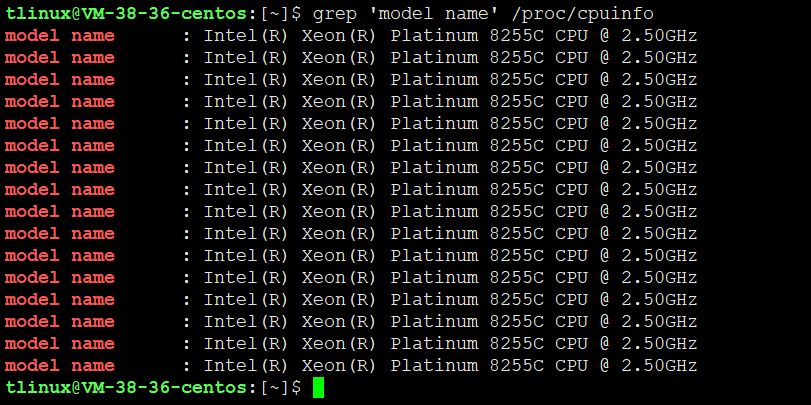

# 如何理解平均负载

每次发现系统变慢时，我们通常做的第一件事，就是执行 top 或者 uptime 命令，来了解系统的负载情况。比如像下面这样，我在命令行里输入了 uptime 命令，系统也随即给出了结果。

```
$ uptime
02:34:03 up 2 days, 20:14,  1 user,  load average: 0.63, 0.83, 0.88
```

但我想问的是，你真的知道这里每列输出的含义吗？

我相信你对前面的几列比较熟悉，它们分别是当前时间、系统运行时间以及正在登录用户数。

```
02:34:03              //当前时间
up 2 days, 20:14      //系统运行时间
1 user                //正在登录用户数
```

而最后三个数字呢，依次则是过去 1 分钟、5 分钟、15 分钟的平均负载（Load Average）。

**平均负载**？这个词对很多人来说，可能既熟悉又陌生，我们每天的工作中，也都会提到这个词，但你真正理解它背后的含义吗？如果你们团队来了一个实习生，他揪住你不放，你能给他讲清楚什么是平均负载吗？

其实，6 年前，我就遇到过这样的一个场景。公司一个实习生一直追问我，什么是平均负载，我支支吾吾半天，最后也没能解释明白。明明总看到也总会用到，怎么就说不明白呢？后来我静下来想想，其实还是自己的功底不够。

于是，这几年，我遇到问题，特别是基础问题，都会多问自己几个“为什么”，以求能够彻底理解现象背后的本质原理，用起来更灵活，也更有底气。

今天，我就带你来学习下，如何观测和理解这个**最常见、也是最重要的系统指标**。

我猜一定有人会说，平均负载不就是单位时间内的 CPU 使用率吗？上面的 0.63，就代表 CPU 使用率是 63%。其实并不是这样，如果你方便的话，可以通过执行 man uptime 命令，来了解平均负载的详细解释。


```
uptime  

gives  a  one  line display of the following information.  The current time, how long the system has been running, how many users are currently logged on, and the system load averages for the past 1, 5, and 15
minutes.
```

简单来说，平均负载是指单位时间内，系统处于可运行状态和不可中断状态的平均进程数，也就是平均活跃进程数，它和 CPU 使用率并没有直接关系。这里我先解释下，可运行状态和不可中断状态这俩词儿。

所谓可运行状态的进程，是指正在使用 CPU 或者正在等待 CPU 的进程，也就是我们常用 ps 命令看到的，处于 R 状态（Running 或 Runnable）的进程。

不可中断状态的进程则是正处于内核态关键流程中的进程，并且这些流程是不可打断的，比如最常见的是等待硬件设备的 I/O 响应，也就是我们在 ps 命令中看到的 **D 状态（Uninterruptible Sleep，也称为 Disk Sleep）**的进程。

比如，当一个进程向磁盘读写数据时，为了保证数据的一致性，在得到磁盘回复前，它是不能被其他进程或者中断打断的，这个时候的进程就处于不可中断状态。**如果此时的进程被打断了，就容易出现磁盘数据与进程数据不一致的问题**。

所以，**不可中断状态实际上是系统对进程和硬件设备的一种保护机制**。

因此，你可以简单理解为，平均负载其实就是平均活跃进程数。平均活跃进程数，直观上的理解就是单位时间内的活跃进程数，但它实际上是活跃进程数的指数衰减平均值。这个“**指数衰减平均**”的详细含义你不用计较，这只是系统的一种更快速的计算方式，你把它直接**当成活跃进程数的平均值**也没问题。

既然平均的是活跃进程数，那么最理想的，就是每个 CPU 上都刚好运行着一个进程，这样每个 CPU 都得到了充分利用。比如当平均负载为 2 时，意味着什么呢？

* 在只有 2 个 CPU 的系统上，意味着所有的 CPU 都刚好被完全占用。
* 在 4 个 CPU 的系统上，意味着 CPU 有 50% 的空闲。
* 而在只有 1 个 CPU 的系统中，则意味着有一半的进程竞争不到 CPU。

## 平均负载为多少时合理

讲完了什么是平均负载，现在我们再回到最开始的例子，不知道你能否判断出，在 uptime 命令的结果里，那三个时间段的平均负载数，多大的时候能说明系统负载高？或是多小的时候就能说明系统负载很低呢？

我们知道，**平均负载最理想的情况是等于 CPU 个数**。所以在评判平均负载时，首先你要知道系统有几个 CPU，这可以通过 top 命令或者从文件 /proc/cpuinfo 中读取，比如：

```
# 关于grep和wc的用法请查询它们的手册或者网络搜索
$ grep 'model name' /proc/cpuinfo | wc -l
```



有了 CPU 个数，我们就可以判断出，当平均负载比 CPU 个数还大的时候，系统已经出现了过载。

不过，且慢，新的问题又来了。我们在例子中可以看到，平均负载有三个数值，到底该参考哪一个呢？

实际上，都要看。三个不同时间间隔的平均值，其实给我们提供了，分析系统负载趋势的数据来源，让我们能更全面、更立体地理解目前的负载状况。

打个比方，就像初秋时北京的天气，如果只看中午的温度，你可能以为还在 7 月份的大夏天呢。但如果你结合了早上、中午、晚上三个时间点的温度来看，基本就可以全方位了解这一天的天气情况了。

同样的，前面说到的 CPU 的三个负载时间段也是这个道理。

1. 如果 1 分钟、5 分钟、15 分钟的三个值基本相同，或者相差不大，那就说明系统负载很平稳。
2. 但如果 1 分钟的值远小于 15 分钟的值，就说明系统最近 1 分钟的负载在减少，而过去 15 分钟内却有很大的负载。
3. 反过来，如果 1 分钟的值远大于 15 分钟的值，就说明最近 1 分钟的负载在增加，这种增加有可能只是临时性的，也有可能还会持续增加下去，所以就需要持续观察。一旦 1 分钟的平均负载接近或超过了 CPU 的个数，就意味着系统正在发生过载的问题，这时就得分析调查是哪里导致的问题，并要想办法优化了。

这里我再举个例子，假设我们在一个单 CPU 系统上看到平均负载为 1.73，0.60，7.98，那么说明在过去 1 分钟内，系统有 73% 的超载，而在 15 分钟内，有 698% 的超载，从整体趋势来看，系统的负载在降低。

那么，在实际生产环境中，平均负载多高时，需要我们重点关注呢？

在我看来，**当平均负载高于 CPU 数量 70% 的时候，你就应该分析排查负载高的问题了**。一旦负载过高，就可能导致进程响应变慢，进而影响服务的正常功能。

但 70% 这个数字并不是绝对的，**最推荐的方法，还是把系统的平均负载监控起来，然后根据更多的历史数据，判断负载的变化趋势**。当发现负载有明显升高趋势时，比如说负载翻倍了，你再去做分析和调查。

## 平均负载与 CPU 使用率

现实工作中，我们经常容易把平均负载和 CPU 使用率混淆，所以在这里，我也做一个区分。

可能你会疑惑，既然平均负载代表的是活跃进程数，那平均负载高了，不就意味着 CPU 使用率高吗？

我们还是要回到平均负载的含义上来，**平均负载是指单位时间内，处于可运行状态和不可中断状态的进程数**。所以，它不仅包括了正在使用 CPU 的进程，还包括等待 CPU 和等待 I/O 的进程。

而 CPU 使用率，是单位时间内 CPU 繁忙情况的统计，跟平均负载并不一定完全对应。比如：

* CPU 密集型进程，使用大量 CPU 会导致平均负载升高，此时这两者是一致的；
* I/O 密集型进程，等待 I/O 也会导致平均负载升高，但 CPU 使用率不一定很高；
* 大量等待 CPU 的进程调度也会导致平均负载升高，此时的 CPU 使用率也会比较高。

## 平均负载案例分析

下面，我们以三个示例分别来看这三种情况，并用 iostat、mpstat、pidstat 等工具，找出平均负载升高的根源。

因为案例分析都是基于机器上的操作，所以不要只是听听、看看就够了，最好还是跟着我实际操作一下。


## 你的准备

下面的案例都是基于 Ubuntu 18.04，当然，同样适用于其他 Linux 系统。我使用的案例环境如下所示。

* 机器配置：2 CPU，8GB 内存。
* 预先安装 stress 和 sysstat 包，如 apt install stress sysstat。

在这里，我先简单介绍一下 stress 和 sysstat。

* stress 是一个 Linux 系统压力测试工具，这里我们用作异常进程模拟平均负载升高的场景。
* sysstat 包含了常用的 Linux 性能工具，用来监控和分析系统的性能。我们的案例会用到这个包的两个命令 mpstat 和 pidstat。
* mpstat 是一个常用的多核 CPU 性能分析工具，用来实时查看每个 CPU 的性能指标，以及所有 CPU 的平均指标。
* pidstat 是一个常用的进程性能分析工具，用来实时查看进程的 CPU、内存、I/O 以及上下文切换等性能指标。


此外，每个场景都需要你开三个终端，登录到同一台 Linux 机器中。

实验之前，你先做好上面的准备。如果包的安装有问题，可以先在 Google 一下自行解决，如果还是解决不了，再来留言区找我，这事儿应该不难。

另外要注意，下面的所有命令，我们都是默认以 root 用户运行。所以，如果你是用普通用户登陆的系统，一定要先运行 sudo su root 命令切换到 root 用户。

如果上面的要求都已经完成了，你可以先用 uptime 命令，看一下测试前的平均负载情况：

```
$ uptime
...,  load average: 0.11, 0.15, 0.09
```

## 场景一：CPU 密集型进程

首先，我们在第一个终端运行 stress 命令，模拟一个 CPU 使用率 100% 的场景：

```
$ stress --cpu 1 --timeout 600
```

接着，在第二个终端运行 uptime 查看平均负载的变化情况：

```
# -d 参数表示高亮显示变化的区域
$ watch -d uptime
...,  load average: 1.00, 0.75, 0.39
```

最后，在第三个终端运行 mpstat 查看 CPU 使用率的变化情况：

```
# -P ALL 表示监控所有CPU，后面数字5表示间隔5秒后输出一组数据
$ mpstat -P ALL 5
Linux 4.15.0 (ubuntu) 09/22/18 _x86_64_ (2 CPU)
13:30:06     CPU    %usr   %nice    %sys %iowait    %irq   %soft  %steal  %guest  %gnice   %idle
13:30:11     all   50.05    0.00    0.00    0.00    0.00    0.00    0.00    0.00    0.00   49.95
13:30:11       0    0.00    0.00    0.00    0.00    0.00    0.00    0.00    0.00    0.00  100.00
13:30:11       1  100.00    0.00    0.00    0.00    0.00    0.00    0.00    0.00    0.00    0.00
```

从终端二中可以看到，1 分钟的平均负载会慢慢增加到 1.00，而从终端三中还可以看到，正好有一个 CPU 的使用率为 100%，但它的 iowait 只有 0。这说明，平均负载的升高正是由于 CPU 使用率为 100% 。

那么，到底是哪个进程导致了 CPU 使用率为 100% 呢？你可以使用 pidstat 来查询：

```
# 间隔5秒后输出一组数据
$ pidstat -u 5 1
13:37:07      UID       PID    %usr %system  %guest   %wait    %CPU   CPU  Command
13:37:12        0      2962  100.00    0.00    0.00    0.00  100.00     1  stress
```

从这里可以明显看到，stress 进程的 CPU 使用率为 100%。

## 场景二：I/O 密集型进程

首先还是运行 stress 命令，但这次模拟 I/O 压力，即不停地执行 sync：

```
$ stress -i 1 --timeout 600
```

还是在第二个终端运行 uptime 查看平均负载的变化情况：

```
$ watch -d uptime
...,  load average: 1.06, 0.58, 0.37
```

然后，第三个终端运行 mpstat 查看 CPU 使用率的变化情况：

```
# 显示所有CPU的指标，并在间隔5秒输出一组数据
$ mpstat -P ALL 5 1
Linux 4.15.0 (ubuntu)     09/22/18     _x86_64_    (2 CPU)
13:41:28     CPU    %usr   %nice    %sys %iowait    %irq   %soft  %steal  %guest  %gnice   %idle
13:41:33     all    0.21    0.00   12.07   32.67    0.00    0.21    0.00    0.00    0.00   54.84
13:41:33       0    0.43    0.00   23.87   67.53    0.00    0.43    0.00    0.00    0.00    7.74
13:41:33       1    0.00    0.00    0.81    0.20    0.00    0.00    0.00    0.00    0.00   98.99
```

从这里可以看到，1 分钟的平均负载会慢慢增加到 1.06，其中一个 CPU 的系统 CPU 使用率升高到了 23.87，而 iowait 高达 67.53%。这说明，平均负载的升高是由于 iowait 的升高。

那么到底是哪个进程，导致 iowait 这么高呢？我们还是用 pidstat 来查询：

```
# 间隔5秒后输出一组数据，-u表示CPU指标
$ pidstat -u 5 1
Linux 4.15.0 (ubuntu)     09/22/18     _x86_64_    (2 CPU)
13:42:08      UID       PID    %usr %system  %guest   %wait    %CPU   CPU  Command
13:42:13        0       104    0.00    3.39    0.00    0.00    3.39     1  kworker/1:1H
13:42:13        0       109    0.00    0.40    0.00    0.00    0.40     0  kworker/0:1H
13:42:13        0      2997    2.00   35.53    0.00    3.99   37.52     1  stress
13:42:13        0      3057    0.00    0.40    0.00    0.00    0.40     0  pidstat
```

可以发现，还是 stress 进程导致的。

## 场景三：大量进程的场景

当系统中运行进程超出 CPU 运行能力时，就会出现等待 CPU 的进程。

比如，我们还是使用 stress，但这次模拟的是 8 个进程：

```
$ stress -c 8 --timeout 600
```

由于系统只有 2 个 CPU，明显比 8 个进程要少得多，因而，系统的 CPU 处于严重过载状态，平均负载高达 7.97：


```
$ uptime
...,  load average: 7.97, 5.93, 3.02
```

接着再运行 pidstat 来看一下进程的情况：

```
# 间隔5秒后输出一组数据
$ pidstat -u 5 1
14:23:25      UID       PID    %usr %system  %guest   %wait    %CPU   CPU  Command
14:23:30        0      3190   25.00    0.00    0.00   74.80   25.00     0  stress
14:23:30        0      3191   25.00    0.00    0.00   75.20   25.00     0  stress
14:23:30        0      3192   25.00    0.00    0.00   74.80   25.00     1  stress
14:23:30        0      3193   25.00    0.00    0.00   75.00   25.00     1  stress
14:23:30        0      3194   24.80    0.00    0.00   74.60   24.80     0  stress
14:23:30        0      3195   24.80    0.00    0.00   75.00   24.80     0  stress
14:23:30        0      3196   24.80    0.00    0.00   74.60   24.80     1  stress
14:23:30        0      3197   24.80    0.00    0.00   74.80   24.80     1  stress
14:23:30        0      3200    0.00    0.20    0.00    0.20    0.20     0  pidstat
```

可以看出，8 个进程在争抢 2 个 CPU，每个进程等待 CPU 的时间（也就是代码块中的 %wait 列）高达 75%。这些超出 CPU 计算能力的进程，最终导致 CPU 过载。

## 小结

分析完这三个案例，我再来归纳一下平均负载的理解。

平均负载提供了一个快速查看系统整体性能的手段，反映了整体的负载情况。但只看平均负载本身，我们并不能直接发现，到底是哪里出现了瓶颈。所以，在理解平均负载时，也要注意：

1. 平均负载高有可能是 CPU 密集型进程导致的；
2. 平均负载高并不一定代表 CPU 使用率高，还有可能是 I/O 更繁忙了；
3. 当发现负载高的时候，你可以使用 mpstat、pidstat 等工具，辅助分析负载的来源。

## 思考

你所理解的平均负载，当你发现平均负载升高后，又是怎么分析排查的呢？


## 总结

学习笔记：


1. iowait无法升高的问题，是因为案例中stress使用的是 sync() 系统调用，它的作用是刷新缓冲区内存到磁盘中。对于新安装的虚拟机，缓冲区可能比较小，无法产生大的IO压力，这样大部分就都是系统调用的消耗了。所以，你会看到只有系统CPU使用率升高。解决方法是使用stress的下一代stress-ng，它支持更丰富的选项，比如 stress-ng -i 1 --hdd 1 --timeout 600（--hdd表示读写临时文件）。
2. pidstat输出中没有%wait的问题，是因为CentOS默认的sysstat稍微有点老，源码或者RPM升级到11.5.5版本以后就可以看到了。而Ubuntu的包一般都比较新，没有这个问题。
3. mpstat无法观测的问题，案例中是等待5秒后输出1次结果就停止了，更好的做法是持续监控一段时间，比如持续观测20次：mpstat -P ALL 5 20。


一、什么是平均负载
正确定义：单位时间内，系统中处于可运行状态和不可中断状态的平均进程数。
错误定义：单位时间内的cpu使用率。
可运行状态的进程：正在使用cpu或者正在等待cpu的进程，即ps aux命令下STAT处于R状态的进程
不可中断状态的进程：处于内核态关键流程中的进程，且不可被打断，如等待硬件设备IO响应，ps命令D状态的进程
理想状态：每个cpu上都有一个活跃进程，即平均负载数等于cpu数
过载经验值：平均负载高于cpu数量70%的时候

二、相关命令
cpu核数: lscpu、 grep 'model name' /proc/cpuinfo | wc -l
显示平均负载：uptime、top，显示的顺序是最近1分钟、5分钟、15分钟，从此可以看出平均负载的趋势
watch -d uptime: -d会高亮显示变化的区域
strees: 压测命令，--cpu cpu压测选项，-i io压测选项，-c 进程数压测选项，--timeout 执行时间
mpstat: 多核cpu性能分析工具，-P ALL监视所有cpu
pidstat: 进程性能分析工具，-u 显示cpu利用率

三、平均负载与cpu使用率的区别
CPU使用率：单位时间内cpu繁忙情况的统计
情况1：CPU密集型进程，CPU使用率和平均负载基本一致
情况2：IO密集型进程，平均负载升高，CPU使用率不一定升高
情况3：大量等待CPU的进程调度，平均负载升高，CPU使用率也升高

四、平均负载过高时，如何调优
工具：stress、sysstat，yum即可安装
1. CPU密集型进程case：
mpstat -P ALL 5: -P ALL表示监控所有CPU，5表示每5秒刷新一次数据，观察是否有某个cpu的%usr会很高，但iowait应很低
pidstat -u 5 1：每5秒输出一组数据，观察哪个进程%cpu很高，但是%wait很低，极有可能就是这个进程导致cpu飚高
2. IO密集型进程case：
mpstat -P ALL 5: 观察是否有某个cpu的%iowait很高，同时%usr也较高
pidstat -u 5 1：观察哪个进程%wait较高，同时%CPU也较高
3. 大量进程case：
pidstat -u 5 1：观察那些%wait较高的进程是否有很多


---
