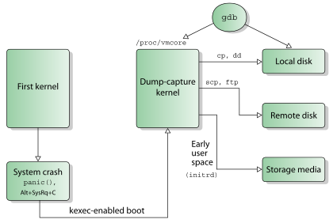
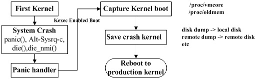
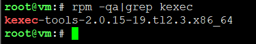
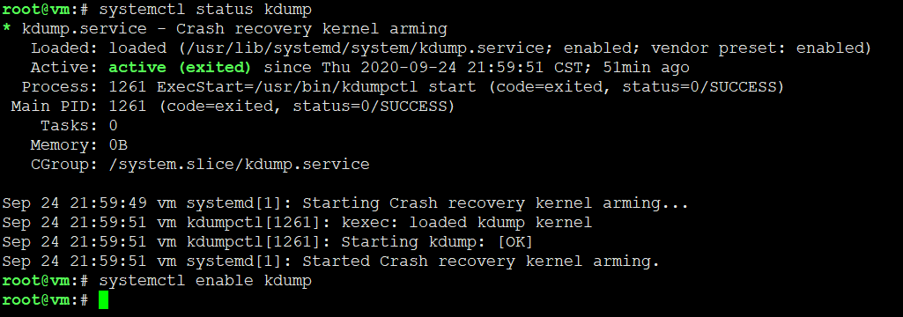
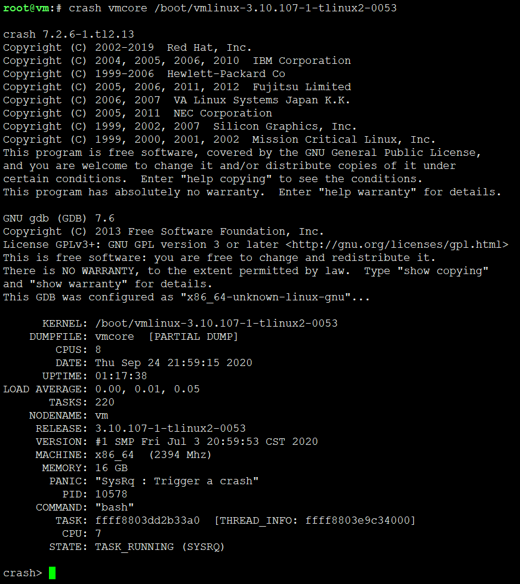

<!-- MDTOC maxdepth:6 firsth1:1 numbering:0 flatten:0 bullets:1 updateOnSave:1 -->

- [深入探索Kdump-01](#深入探索kdump-01)   
   - [kdump基本概念](#kdump基本概念)   
      - [什么是 kexec ？](#什么是-kexec-？)   
      - [什么是 kdump ？](#什么是-kdump-？)   
      - [如何使用 kdump](#如何使用-kdump)   
      - [如何访问捕获内存](#如何访问捕获内存)   
      - [kdump 的优势](#kdump-的优势)   
   - [Kdump 实现流程](#kdump-实现流程)   
   - [配置 kdump](#配置-kdump)   
      - [安装软件包和实用程序](#安装软件包和实用程序)   
      - [参数相关设置](#参数相关设置)   
      - [kdump 配置文件](#kdump-配置文件)   
      - [启动 kdump 服务](#启动-kdump-服务)   
      - [测试配置是否有效](#测试配置是否有效)   
   - [载入“转储捕获”内核](#载入“转储捕获”内核)   

<!-- /MDTOC -->
# 深入探索Kdump-01

官方站点：<http://lse.sourceforge.net/kdump/>




## kdump基本概念

### 什么是 kexec ？

Kexec 是实现 kdump 机制的关键，它包括 2 个组成部分：

1. 一是内核空间的系统调用 kexec_load，负责在**生产内核（production kernel 或 first kernel）**启动时将**捕获内核（capture kernel 或 sencond kernel）**加载到指定地址。
2. 二是用户空间的工具 kexec-tools，他将捕获内核的地址传递给生产内核，从而在系统崩溃的时候能够找到捕获内核的地址并运行。

**没有 kexec 就没有 kdump**。先有 kexec 实现了在一个内核中可以启动另一个内核，才让 kdump 有了用武之地。kexec 原来的目的是为了节省 kernel 开发人员重启系统的时间，谁能想到这个“偷懒”的技术却孕育了最成功的内存转存机制呢？

### 什么是 kdump ？

Kdump 的概念出现在 2005 左右，是迄今为止最可靠的内核转存机制，已经被主要的 linux™ 厂商选用。kdump 是一种先进的基于 kexec 的内核崩溃转储机制。**当系统崩溃时，kdump 使用 kexec 启动到第二个内核。第二个内核通常叫做捕获内核，以很小内存启动以捕获转储镜像。第一个内核保留了内存的一部分给第二内核启动用。**由于 kdump 利用 kexec 启动捕获内核，绕过了 BIOS，所以第一个内核的内存得以保留。这是内核崩溃转储的本质。

kdump 需要两个不同目的的内核，生产内核和捕获内核。生产内核是捕获内核服务的对像。捕获内核会在生产内核崩溃时启动起来，与相应的 ramdisk 一起组建一个微环境，用以对生产内核下的内存进行收集和转存。

### 如何使用 kdump

构建系统和 dump-capture 内核，此操作有 2 种方式可选：

1. 构建一个单独的自定义转储捕获内核以捕获内核转储；
2. 或者将系统内核本身作为转储捕获内核，这就不需要构建一个单独的转储捕获内核。

方法（2）只能用于可支持可重定位内核的体系结构上；目前 i386，x86_64，ppc64 和 ia64 体系结构支持可重定位内核。构建一个可重定位内核使得不需要构建第二个内核就可以捕获转储。但是可能有时想构建一个自定义转储捕获内核以满足特定要求。

### 如何访问捕获内存

在内核崩溃之前所有关于核心映像的必要信息都用 ELF 格式编码并存储在保留的内存区域中。ELF 头所在的物理地址被作为命令行参数（fcorehdr=）传递给新启动的转储内核。

在 i386 体系结构上，启动的时候需要使用物理内存开始的 640K，而不管操作系统内核转载在何处。因此，这个 640K 的区域在重新启动第二个内核的时候由 kexec 备份。

在第二个内核中，“前一个系统的内存”可以通过两种方式访问：

1. 通过 /dev/oldmem 这个设备接口

一个“捕捉”设备可以使用“raw”（裸的）方式 “读”这个设备文件并写出到文件。这是关于内存的 “裸”的数据转储，同时这些分析 / 捕捉工具应该足够“智能”从而可以知道从哪里可以得到正确的信息。ELF 文件头（通过命令行参数传递过来的 elfcorehdr）可能会有帮助。

2. 通过 /proc/vmcore。

这个方式是将转储输出为一个 ELF 格式的文件，并且可以使用一些文件拷贝命令（比如 cp，scp 等）将信息读出来。同时，gdb 可以在得到的转储文件上做一些调试（有限的）。这种方式保证了内存中的页面都以正确的途径被保存 ( 注意内存开始的 640K 被重新映射了 )。

### kdump 的优势

* 高可靠性

崩溃转储数据可从一个新启动内核的上下文中获取，而不是从已经崩溃内核的上下文。

* 多版本支持

LKCD(Linux Kernel Crash Dump)，netdump，diskdump 已被纳入 LDPs(Linux Documen-tation Project) 内核。SUSE 和 RedHat 都对 kdump 有技术支持。

## Kdump 实现流程


**图中6）是否捕获成功？的N和Y反了**



## 配置 kdump

### 安装软件包和实用程序

Kdump 用到的各种工具都在 kexec-tools 中。kernel-debuginfo 则是用来分析 vmcore 文件。从 rhel5 开始，kexec-tools 已被默认安装在发行版。而 novell 也在 sles10 发行版中把 kdump 集成进来。所以如果使用的是 rhel5 和 sles10 之后的发行版，那就省去了安装 kexec-tools 的步骤。而如果需要调试 kdump 生成的 vmcore 文件，则需要手动安装 kernel-debuginfo 包。检查安装包操作：



### 参数相关设置

系统内核设置选项和转储捕获内核配置选择在《使用 Crash 工具分析 Linux dump 文件》一文中已有说明，在此不再赘述。仅列出内核引导参数设置以及配置文件设置。

**修改内核引导参数，为启动捕获内核预留内存**

通过下面的方法来配置 kdump 使用的内存大小。添加启动参数"crashkernel=Y@X"，这里，Y 是为 kdump 捕捉内核保留的内存，X 是保留部分内存的开始位置。

1. 对于 i386 和 x86_64, 编辑 /etc/grub.conf, 在内核行的最后添加"crashkernel=128M" 。
2. 对于 ppc64，在 /etc/yaboot.conf 最后添加"crashkernel=128M"。

在 ia64, 编辑 /etc/elilo.conf，添加"crashkernel=256M"到内核行。

### kdump 配置文件

kdump 的配置文件是 /etc/kdump.conf（RHEL6.2）；/etc/sysconfig/kdump(SLES11 sp2)。每个文件头部都有选项说明，可以根据使用需求设置相应的选项。

### 启动 kdump 服务

在设置了预留内存后，需要重启机器，否则 kdump 是不可使用的。启动 kdump 服务：



### 测试配置是否有效

可以通过 kexec 加载内核镜像，让系统准备好去捕获一个崩溃时产生的 vmcore。可以通过 sysrq 强制系统崩溃。

```
# echo c > /proc/sysrq-trigger
```

这造成内核崩溃，如配置有效，系统将重启进入 kdump 内核，当系统进程进入到启动 kdump 服务的点时，vmcore 将会拷贝到你在 kdump 配置文件中设置的位置。

* RHEL 的缺省目录是 : /var/crash；
* SLES 的缺省目录是 : /var/log/dump

具体配置文件在各个发行版的/etc/kdump.conf中

然后系统重启进入到正常的内核。一旦回复到正常的内核，就可以在上述的目录下发现 vmcore 文件，即内存转储文件。可以使用之前安装的 kernel-debuginfo 中的 crash 工具来进行分析（crash 的更多详细用法将在本系列后面的文章中有介绍）。



## 载入“转储捕获”内核

需要引导系统内核时，可使用如下步骤和命令载入“转储捕获”内核：

```
kexec -p <dump-capture-kernel> \
    --initrd=<initrd-for-dump-capture-kernel> --args-linux \
    --append="root=<root-dev> init 1 irqpoll"
```

装载转储捕捉内核的注意事项：

1. 转储捕捉内核应当是一个 vmlinux 格式的映像（即是一个未压缩的 ELF 映像文件），而不能是 bzImage 格式；
2. 默认情况下，ELF 文件头采用 ELF64 格式存储以支持那些拥有超过 4GB 内存的系统。但是可以指定“--elf32-core-headers”标志以强制使用 ELF32 格式的 ELF 文件头。这个标志是有必要注意的，一个重要的原因就是：当前版本的 GDB 不能在一个 32 位系统上打开一个使用 ELF64 格式的 vmcore 文件。ELF32 格式的文件头不能使用在一个“没有物理地址扩展”（non-PAE）的系统上（即：少于 4GB 内存的系统）;
3. 一个“irqpoll”的启动参数可以减低由于在“转储捕获内核”中使用了“共享中断”技术而导致出现驱动初始化失败这种情况发生的概率 ;
4. 必须指定 <root-dev>，指定的格式是和要使用根设备的名字。具体可以查看 mount 命令的输出；“init 1”这个命令将启动“转储捕捉内核”到一个没有网络支持的单用户模式。如果你希望有网络支持，那么使用“init 3”。


---
