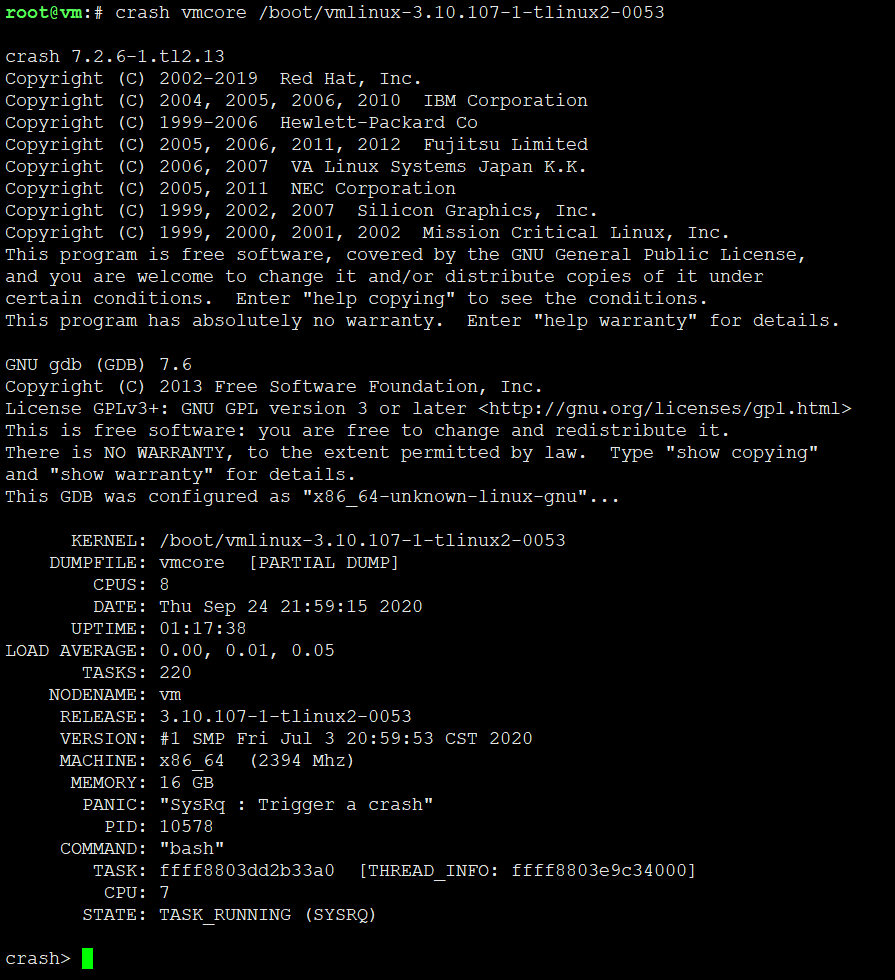

# crash




## crash子命令

```
crash> help

*              extend         mach           repeat         tree           
alias          files          mod            runq           union          
ascii          foreach        mount          search         vm             
bpf            fuser          net            set            vtop           
bt             gdb            p              sig            waitq          
btop           help           ps             struct         whatis         
chkbug         ipcs           pte            swap           wr             
dev            irq            ptob           sym            q              
dis            kmem           ptov           sys            
eval           list           rbtree         task           
exit           log            rd             timer          

crash version: 7.2.6-1.tl2.13   gdb version: 7.6
For help on any command above, enter "help <command>".
For help on input options, enter "help input".
For help on output options, enter "help output".

```

### mod子命令
