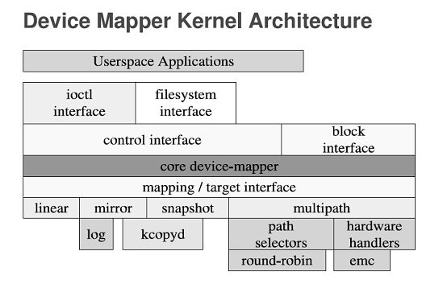
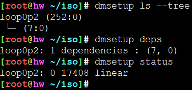

# dmsetup

## 作用

device mapper 管理

dmsetup - low level logical volume management

Device mapper是linux的内核用来将块设备映射到虚拟块设备的framework。

dmsetup 命令是一个用来与 Device Mapper 沟通的命令行封装器（wrapper），用来管理Device Mapper框架中的卷设备


## 语法

```
dmsetup clear device_name
dmsetup create device_name [-u uuid] [--notable|--table <table>|
      table_file] [{--addnodeoncreate|--addnodeonresume}] [--readahead [+]<sectors>|auto|none]
dmsetup deps [-o options] [device_name]
dmsetup help [-c|-C|--columns]
dmsetup info [device_name]
dmsetup info -c|-C|--columns [--noheadings] [--separator separator]
      [-o fields] [-O|--sort sort_fields] [device_name]
dmsetup load device_name [--table <table>|table_file]
dmsetup ls [--target target_type] [--exec command] [--tree] [-o options]
dmsetup message device_name sector message
dmsetup mknodes [device_name]
dmsetup mangle [device_name]
dmsetup reload device_name [--table <table>|table_file]
dmsetup wipe_table device_name
dmsetup remove [-f|--force] [--retry] device_name
dmsetup remove_all [-f|--force]
dmsetup rename device_name new_name
dmsetup rename device_name --setuuid uuid
dmsetup resume device_name [{--addnodeoncreate|--addnodeonresume}]
      [--readahead [+]<sectors>|auto|none]
dmsetup setgeometry device_name cyl head sect start
dmsetup splitname device_name [subsystem]
dmsetup status [--target target_type] [device_name]
dmsetup suspend [--nolockfs] [--noflush] device_name
dmsetup table [--target target_type] [--showkeys] [device_name]
dmsetup targets
dmsetup udevcomplete cookie
dmsetup udevcomplete_all [age_in_minutes]
dmsetup udevcookies
dmsetup udevcreatecookie
dmsetup udevflags cookie
dmsetup udevreleasecookie [cookie]
dmsetup version
dmsetup wait device_name [event_nr]

devmap_name major minor
devmap_name major:minor
```


## 基本概念

### Device Mapper



### thin,thin-pool


## 基本用法

### 查看虚拟块设备映射表

dmsetup 读取 /dev/mapper/目录下块设备，每一个都有一个表格记录。相比于ls更为详细的输出。

```
dmsetup table
```

每个虚拟的块设备有一个table，记录了映射的情况，dmsetup table可以查看。
```
vg11-lv1: 0 1024000 linear 8:16 2048
VolGroup00-LogVol01: 0 3145728 linear 8:3 79038464
VolGroup00-LogVol00: 0 79036416 linear 8:3 2048
```
man dmsetup中介绍了table的格式:
```
logical_start_sector num_sectors target_type target_args
开始扇区             扇区数      设备类型    设备参数
```

## 查看虚拟块设备

```
dmsetup ls
```

显示更为精简，同样是读取/dev/mapper/下的设备块

```
vg11-lv1	(253:2)
VolGroup00-LogVol01	(253:1)
VolGroup00-LogVol00	(253:0)
```



## 移除逻辑卷

```
dmsetup remove centos-swap
```


## 参考

* <https://www.lijiaocn.com/%E6%8A%80%E5%B7%A7/2017/07/07/linux-tool-devicemapper.html>
* <https://access.redhat.com/documentation/zh-cn/red_hat_enterprise_linux/7/html/logical_volume_manager_administration/dmsetup>
* <https://www.ibm.com/developerworks/cn/linux/l-devmapper/index.html>
* <https://access.redhat.com/documentation/zh-cn/red_hat_enterprise_linux/7/html/logical_volume_manager_administration/udev_device_manager>
