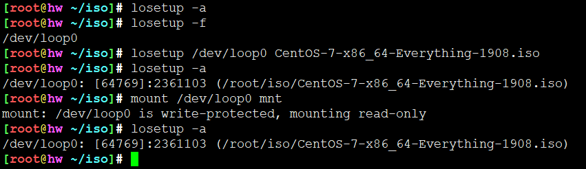
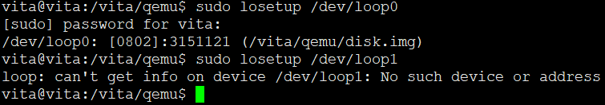
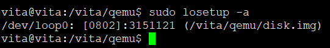
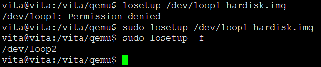
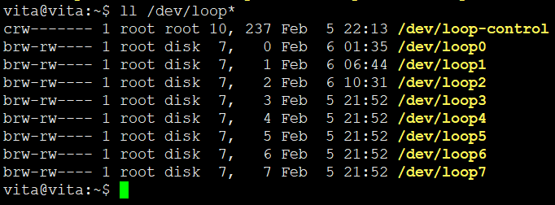
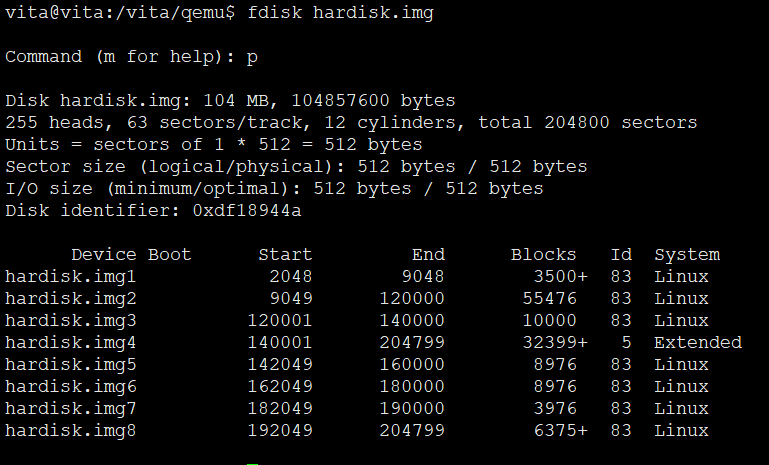
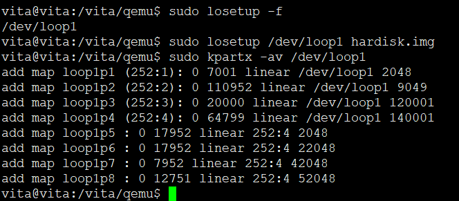
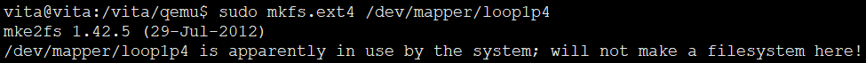
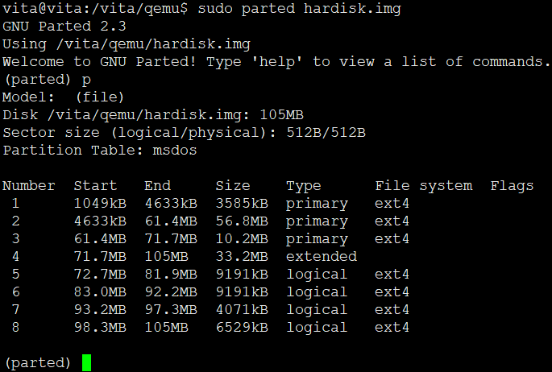

<!-- MDTOC maxdepth:6 firsth1:1 numbering:0 flatten:0 bullets:1 updateOnSave:1 -->

- [losetup挂载回环设备](#losetup挂载回环设备)   
   - [作用](#作用)   
   - [语法](#语法)   
   - [基本概念](#基本概念)   
      - [Linux下 loop 设备](#linux下-loop-设备)   
   - [常见用法](#常见用法)   
   - [使用losetup与mount挂载iso的区别](#使用losetup与mount挂载iso的区别)   
      - [获取/dev/loop*的状态](#获取devloop的状态)   
      - [获取所有loop设备状态](#获取所有loop设备状态)   
      - [获取可用loop设备](#获取可用loop设备)   
   - [查看一个镜像被挂载情况](#查看一个镜像被挂载情况)   
      - [losetup与kpartx配置实现img多分区](#losetup与kpartx配置实现img多分区)   
   - [参考](#参考)   

<!-- /MDTOC -->
# losetup挂载回环设备

## 作用

losetup - set up and control loop devices

* 本质只能类似于mount
* 多分区挂载不可获取

## 语法

```
SYNOPSIS
       Get info:

            losetup loopdev

            losetup -a

            losetup -j file [-o offset]

       Delete loop:

            losetup -d loopdev...

       Print name of first unused loop device:

            losetup -f

       Setup loop device:

            losetup [{-e|-E} encryption] [-o offset] [--sizelimit size]
                    [-p pfd] [-r] {-f[--show]|loopdev} file

       Resize loop device:

            losetup -c loopdev
```

```
Usage:
 losetup loop_device                             give info
 losetup -a | --all                              list all used
 losetup -d | --detach <loopdev> [<loopdev> ...] delete
 losetup -f | --find                             find unused
 losetup -c | --set-capacity <loopdev>           resize
 losetup -j | --associated <file> [-o <num>]     list all associated with <file>
 losetup [options] {-f|--find|loopdev} <file>    setup

Options:
 -e, --encryption <type> enable data encryption with specified <name/num>
 -h, --help              this help
 -o, --offset <num>      start at offset <num> into file
     --sizelimit <num>   loop limited to only <num> bytes of the file
 -p, --pass-fd <num>     read passphrase from file descriptor <num>
 -r, --read-only         setup read-only loop device
     --show              print device name (with -f <file>)
 -N | --nohashpass       Do not hash the given password (Debian hashes)
 -k | --keybits <num>    specify number of bits in the hashed key given
                         to the cipher.  Some ciphers support several key
                         sizes and might be more efficient with a smaller
                         key size.  Key sizes < 128 are generally not
                         recommended
 -v, --verbose           verbose mode


```

## 基本概念

### Linux下 loop 设备

* 在类 UNIX 系统里，loop 设备是一种**伪设备(pseudo-device)**，或者也可以说是仿真设备。它能使我们像块设备一样访问一个文件。
* 在使用之前，一个 loop 设备必须要和一个文件进行连接。这种结合方式给用户提供了一个替代块特殊文件的接口。因此，如果这个文件包含有一个完整的文件系统，那么这个文件就可以像一个磁盘设备一样被 mount 起来。
* 我们经常见到的是 CD 或 DVD 的 ISO 光盘镜像文件或者是软盘(硬盘)的 *.img 镜像文件。通过这种 loop mount (回环mount)的方式，这些镜像文件就可以被 mount 到当前文件系统的一个目录下。
* 顺便可以再理解一下 loop 之含义：对于第一层文件系统，它直接安装在我们计算机的物理设备之上；而对于这种被 mount 起来的镜像文件(它也包含有文件系统)，它是建立在第一层文件系统之上，这样看来，**它就像是在第一层文件系统之上再绕了一圈的文件系统，所以称为 loop。**

* 维基百科中关于/dev/loop介绍 : <https://en.wikipedia.org/wiki/Loop_device>


## 常见用法

## 使用losetup与mount挂载iso的区别

* 一般情况下，img文件可以mount(如果img中有文件系统，可以挂载，可以写入)
* 一般iso挂载都是仅只读，因为iso格式特殊

使用mount挂载的镜像只能用umount解挂，losetup -d 无效


使用losetup挂载iso镜像，



本质无差别，只是mount命令一条解决，losetup需要先关联再挂载

### 获取/dev/loop*的状态

```
losetup loop_device                             give info
```



### 获取所有loop设备状态

```
losetup -a | --all                              list all used
```



### 获取可用loop设备


```
 losetup -f | --find                             find unused
```



## 查看一个镜像被挂载情况

* 一个镜像可多次挂载到不同loop
*




### losetup与kpartx配置实现img多分区

* 直接挂载带分区表及文件系统的img，只能支持一个分区
* 如果映像文件(.img)含有分区表的话，那么用losetup不适用。因为losetup只能加载无分区的文件系统映像文件。但可以配置kpartx实现多分区
* mount不支持多分区挂载
* losetup + kpartx 把挂载步骤拆分，进而实现多分区

多分区img挂载过程

```

```





分别格式化各个分区（扩展分区无法格式化，不符合需求且会报错）：

```
sudo mkfs.ext4 /dev/mapper/loop1p1
sudo mkfs.ext4 /dev/mapper/loop1p2
sudo mkfs.ext4 /dev/mapper/loop1p3
sudo mkfs.ext4 /dev/mapper/loop1p4
sudo mkfs.ext4 /dev/mapper/loop1p5
sudo mkfs.ext4 /dev/mapper/loop1p6
sudo mkfs.ext4 /dev/mapper/loop1p7
sudo mkfs.ext4 /dev/mapper/loop1p8

```





```
sudo mount /dev/mapper/loop1p1 /mnt/loop1p1
sudo mount /dev/mapper/loop1p2 /mnt/loop1p2
sudo mount /dev/mapper/loop1p3 /mnt/loop1p3

sudo mount /dev/mapper/loop1p5 /mnt/loop1p5
sudo mount /dev/mapper/loop1p6 /mnt/loop1p6
sudo mount /dev/mapper/loop1p7 /mnt/loop1p7
sudo mount /dev/mapper/loop1p8 /mnt/loop1p8

```

* 之后在/dev/mapper中可以挂载对应的块设备，可读写
* MBR分区表只够存四个条目，扩展分区就是占用一个条目作为新增的、多出来的、扩展的分区表，用来存放超过四个分区的情况
* 超过四个分区，一定会至少有一个扩展分区。相当于浪费一个条目


多分区img卸载过程

首先umount挂载mapper的块设备

```
sudo umount /dev/mapper/loop1p1
sudo umount /dev/mapper/loop1p2
sudo umount /dev/mapper/loop1p3

sudo umount /dev/mapper/loop1p5
sudo umount /dev/mapper/loop1p6
sudo umount /dev/mapper/loop1p7
sudo umount /dev/mapper/loop1p8
```

之后解除kpartx创建的loop与mapper设备的关联

```
sudo dmsetup remove /dev/mapper/loop1p1
sudo dmsetup remove /dev/mapper/loop1p2
sudo dmsetup remove /dev/mapper/loop1p3

sudo dmsetup remove /dev/mapper/loop1p5
sudo dmsetup remove /dev/mapper/loop1p6
sudo dmsetup remove /dev/mapper/loop1p7
sudo dmsetup remove /dev/mapper/loop1p8
```

最后解除img与loop的关联

```
sudo losetup -d /dev/loop1
```


## 参考

* <https://www.cnblogs.com/Jer-/p/3330128.html>
