# iptables-netfilter基础

## 课堂笔记

*   iptables
    *   Firewall：防火墙 = 隔离工具。区别于建筑防火墙。工作于主机或网络边缘，对于进出本主机或本网络的报文根据事先定义的检查规则作匹配检测，对于能够被规则匹配到的报文作出相应处理的组件；网络攻击无非就是特殊改造的报文对主机发起攻击，防火墙区别于杀毒软件。
        *   主机防火墙
        *   网络防火墙


```
建筑设计专业术语，指防止火灾蔓延至相邻区域且耐火极限不低于3小时的不燃性墙体。用于划分防火分区，或防止建筑间火灾蔓延的重要分隔构件，能在火灾初期和灭火过程中，将火灾有效限制在一定空间内，阻断火灾在防火墙的一侧蔓延到另一侧，对于减少火灾损失具有重要作用。
```


防火墙就类似于古代画像抓人，如果匹配就抓。虽然画的不像，所以很多冤案。

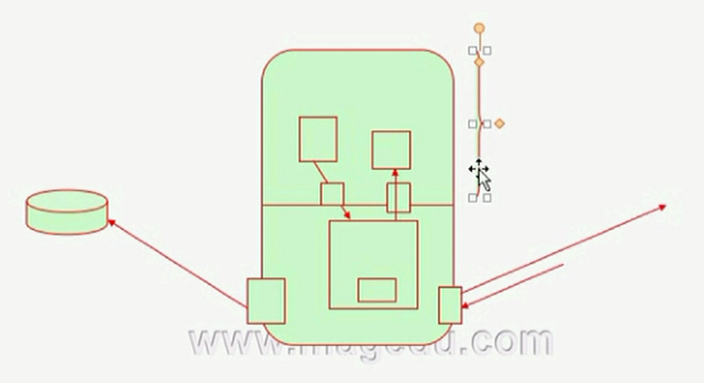

*   防火墙都有哪些机制？
    *   内核态流量出入口钩子函数（相当于检票机，挡住流量然后匹配规则，符合规则执行规则动作，否则默认动作）
    *   选定卡点，关键点进行hook，做检查
    *   防火墙只能最内部和外部的流量进行检测，但是如果内部出现了内奸，防火墙没用了，**家贼难防**
    *   互联网70%的攻击都是内鬼所为。

*   防火墙未必能防火？
    *   类似于贿赂，赛一把钞票就放行
    *   伪装特定报文就无法检测出来，类似于隧道机制。并且涉及到防火墙检测规则项目相关。
*   NAT网络地址转换
    *   雁过拔毛式。若要过此路留下买路财。
    *   NAT是网络地址转换，比方说有一万用户一千个IP，每个用户一个IP肯定不够，但同时上线的用户可能只有500，于是分给用户私网IP，等他上线时NAT设备进行私网IP和公网IP的映射转化。
    *   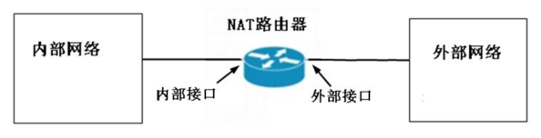
*   PAT端口地址转换
    *   PAT是端口地址转换，比方说有一万个用户而只有一百个IP，同时上线的用户也许好几百个，这样NAT的方法也就满足不了了，于是只好把用户的私网IP+端口映射到一个公网IP+端口上，当然其他的用户也可以映射到相同的IP上，最后通过端口号来区分。
    *   NAT好歹还能保证一个用户有自己专用的IP，而PAT就只能保证一个用户只有自己专用的端口了，PAT叫端口地址转换，NAT是网络地址转换，由RFC 1631定义。


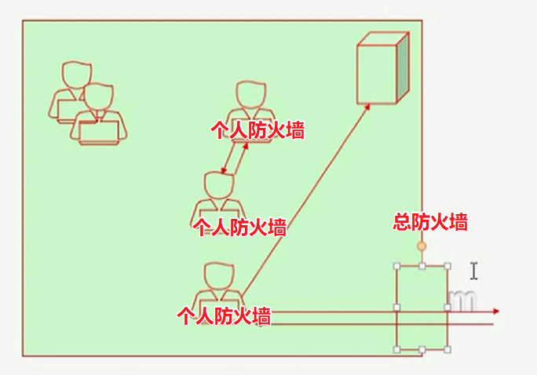

*   网络攻击和杀毒软件的区别

    *   攻击归攻击，杀毒归杀毒。杀毒针对的是任何形式的可执行程序，攻击针对的是流量

*   入侵检测系统IDS

    *   能够根据主机所受到的外部条件的影响作出相应的控制操作
    *   如果检测到流量攻击，防火墙新增规律阻断流量
    *   如果检测到某应用程序的异常流量通信，杀毒软件扼制程序运行
    *   入侵检测能够发现攻击行为并且告知防火墙，让防火墙将攻击报文拒之门外。两者联动
    *   IDS不一定跟防火墙联动，有一定滞后性，比如发现流量异常给管理员发送警告或者仅仅弹窗提醒。
    *   HIDS 主机入侵检测系统
    *   NIDS 网络入侵检测系统
    *   蜜罐honeypot
        *   伪装

*   入侵防御系统(*IPS*: Intrusion Prevention System)

    *   入侵防御系统(Intrusion-prevention system)是一部能够监视网络或网络设备的网络资料传输行为的[计算机网络安全](https://baike.baidu.com/item/%E8%AE%A1%E7%AE%97%E6%9C%BA%E7%BD%91%E7%BB%9C%E5%AE%89%E5%85%A8/6357)设备，能够即时的中断、调整或隔离一些不正常或是具有伤害性的网络资料传输行为。

    

---

*   iptables
    *   iptables是内核中的防火墙么？不是，但防火墙一般是内核中实现的功能，那iptables到底什么实现原理？
    *   iptables全称其实叫iptables/netfilter
        *   framwork：netfilter-内核态hook钩子在网络流经关键位置。有钩子能够把报文捕获，但是没有规则，规则在哪里？但是规则必须符合规则并且放到恰当hook钩子的位置才能正常工作。
            *   netfilter是内核中本身实现的框架。也就hook默认就是存在的，但是没有启用规则，默认都是放行。
            *   只要os在运行，内核就必然运行，一旦把规则设定，那么hook必然开始匹配，也就是说，匹配规则需要从用户态流经内核态。但是内核一般是动态运行，也就是说在内存中，它的规则也必然出于内核态的内存的某个角落，所以一旦重启系统，规则就没了，但是如果设定了脚本，那么开机启动时候通过脚本
        *   那么iptables的五个关键位置具体在哪里，你大致猜一下会在哪里？规则即使要把钩子放到五个函数的哪个地方。
            *   限制本机访问别人？
            *   限制别人访问本机？
            *   限制发给第三者的包我要不要帮忙传递？
        *   这五个钩子在iptables成为链chain 
    *   iptables功能-四个表的作用，每一个功能都要通过5个钩子发挥作用。
        *   filter：过滤，防火墙
        *   nat：网络地址转换，network address translation。
        *   mangle：除了地址可以转换之外其他部分都可以转换。它的作用就是拆分报文作出修改然后再次包装发送。
        *   raw：属于nat的补充，作用在于关闭nat表上启用的链接追踪机制。一般NAT都要启用链接追踪，不然会产生问题。raw用的比较少。链接追踪其实是个非常有用的功能。
    *   **链接追踪的作用**：能够识别先前的访问者，如果想要追踪每一个链接，怎么办？你就需要建立一个非常庞大的追踪表才可以
        *   典型的例子就是老顾客，你怎么识别老顾客？ **老顾客与狗不得入内**
        *   要想追踪链接你就需要记下来，记下来肯定需要消耗内存空间。因为数据量庞大会造成内存溢出。对于非常繁忙的服务器，链接追踪是万万不能开启。不得不启用则必须提供足够大的内存才行。
    *   五条链的作用。链（内置）
        *   PREROUTING：路由之前
        *   INPUT：本机接收到的
        *   FORWARD：本机转发
        *   OUTPUT：本机发出的
        *   POSTROUTING：第二次路由决策作出处理
            *   REROUTING和POSTROUGING，跟网卡没有关系，他们只是TCP/IP协议栈上的功能，可以是任意网卡
    *   四个功能五个表，每一个链会构成一个规则。
        *   流入：PREROUTING --> INPUT
        *   流出：OUTPUT --->POSTROUTING
        *   转发：PREROUTING --> FORWARD --> POSTROUTING
    *   各功能的分别实现。**你要用的时候首先应该详情用在哪个表，以及对应表的所在链上**
        *   filter：INPUT、FORWARD、OUTPUT
            *   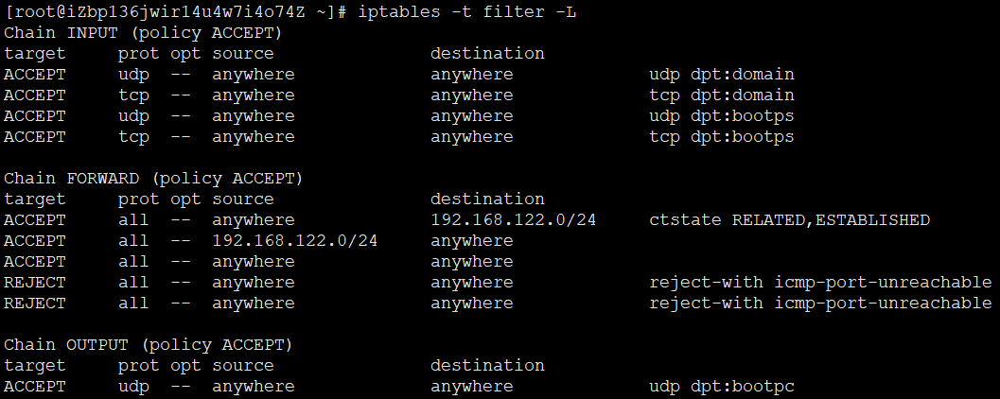
        *   nat：PREROUTING(DNAT)、OUTPUT、POSTROUGING(SNAT)
            *   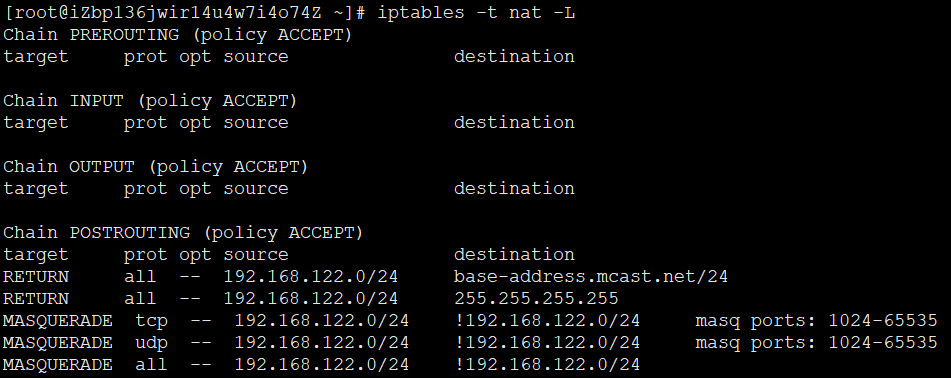
        *   mangle：PREROUTING、INPUT、FORWARD、OUTPUT、POSTROUTING
            *   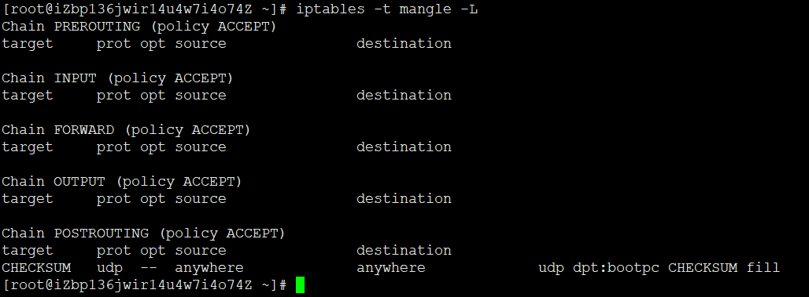
        *   raw：PREROUTING 、OUTPUT
            *   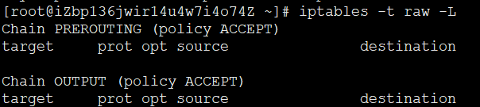
    *   路由发生的时刻
        *   报文进入本机后
            *   判断目标主机
        *   报文发出之前
            *   判断经由哪个接口送往下一跳


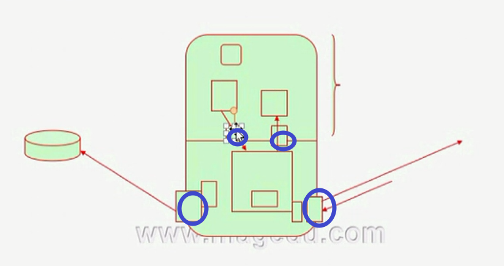

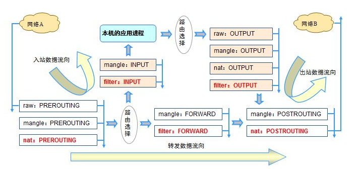

*   iptables
    *   四表五链
        *   raw、mangle、nat、filter
        *   REROUTING、INPUT、OUTPUT、POSTROUTING、FORWARD
    *   添加规则时考量点
        *   要实现那种功能，判断添加到哪张表
        *   报文流经的路径，判断添加到哪个链上
    *   链上规则的次序，即为检查的次序，因此隐含一定的法则
        1.  同类规则（访问同一种应用），匹配范围小的放上面。越优先匹配的越前，不至于到最后才匹配
        2.  不同类规则（访问不同应用），访问频率大的，匹配到报文频率较大的放上面
        3.  设置默认策略
            *  白名单 - 建议
            *  黑名单
        4.  可有一条规则描述的多条规则合并为一个规则
        5.  如果用不到应该关闭链接追踪功能


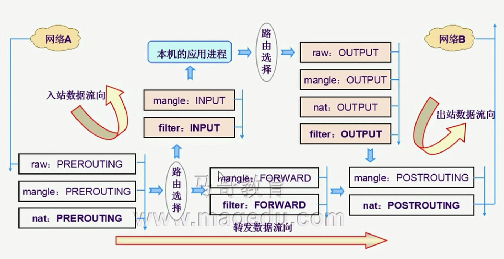

*   数据包过滤匹配流程

    *   过滤优先级是既定的
        *   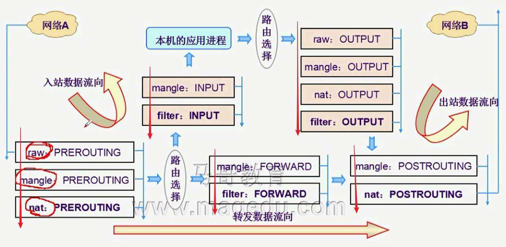
        *   既定优先级raw,mangle,nat,filter

*   规则,真正发挥作用的地方
    *   组成部分
        *   报文的匹配条件
            *   匹配条件?根据协议报文特征指定
                *   基本匹配条件
                    *   源IP/目的IP
                    *   源端口/目标端口
                *   扩展匹配条件
        *   匹配到之后的处理动作
            *   处理动作?

                *   内建处理机制
                    *   DROP
                    *   ACCEPT
                    *   REJECT

                *   自定义处理机制
            *   注意：报文不会经过自定义链，只能在内置链上通过规则进行引用后生效
                    


```
iptables： 包过滤型的防火墙

	Firewall：防火墙，隔离工具；工作于主机或网络边缘，对于进出本主机或本网络的报文根据事先定义的检查规则作匹配检测，对于能够被规则匹配到的报文作出相应处理的组件；
		主机防火墙
		网络防火墙

		软件防火墙（软件逻辑）
		硬件防火墙（硬件和软件逻辑）

	ipfw (firewall framework)
	ipchains (firewall framework)

	iptables(netfilter)
		netfilter：kernel
		iptables：rules until

		hook function：
			input
			output
			forward
			prerouting
			postrouting

	链（内置）：
		PREROUTING
		INPUT
		FORWARD
		OUTPUT
		POSTROUTING

	功能：
		filter：过滤，防火墙；
		nat：network address translation；用于修改源IP或目标IP，也可以改端口；
		mangle：拆解报文，做出修改，并重新封装起来；
		raw：关闭nat表上启用的连接追踪机制；

	功能<--链：
		raw：PREROUTING， OUTPUT
		mangle：PREROUTING，INPUT，FORWARD，OUTPUT，POSTROUTING
		nat：PREROUTING，[INPUT，]OUTPUT，POSTROUTING
		filter：INPUT，FORWARD，OUTPUT

	报文流向：
		流入本机：PREROUTING --> INPUT
		由本机流出：OUTPUT --> POSTROUTING
		转发：PREROUTING --> FORWARD --> POSTROUTING

	路由功能发生的时刻：
		报文进入本机后：
			判断目标主机是？
		报文离开本机之前：
			判断经由哪个接口送往下一站？
	iptables/netfilter

		规则：
			组成部分：根据规则匹配条件来尝试匹配报文，一旦匹配成功，就由规则定义的处理动作作出处理；
				匹配条件：
					基本匹配条件
					扩展匹配条件
				处理动作：
					基本处理动作
					扩展处理动作
					自定义处理机制

			iptables的链：内置链和自定义链
				内置链：对应于hook function
				自定义链接：用于内置链的扩展和补充，可实现更灵活的规则管理机制；

		添加规则时的考量点：
			(1) 要实现哪种功能：判断添加到哪个表上；
			(2) 报文流经的路径：判断添加到哪个链上；

			链：链上的规则次序，即为检查的次序；因此，隐含一定的应用法则：
				(1) 同类规则（访问同一应用），匹配范围小的放上面；
				(2) 不同类的规则（访问不同应用），匹配到报文频率较大的放在上面；
				(3) 将那些可由一条规则描述的多个规则合并起来；
				(4) 设置默认策略；

		iptables命令：

			iptables [-t table] {-A|-C|-D} chain rule-specification

			iptables [-t table] -I chain [rulenum] rule-specification

			iptables [-t table] -R chain rulenum rule-specification

			iptables [-t table] -D chain rulenum

			iptables [-t table] -S [chain [rulenum]]

			iptables [-t table] {-F|-L|-Z} [chain [rulenum]] [options...]

			iptables [-t table] -N chain

			iptables [-t table] -X  [chain]

			iptables [-t table] -P chain target

			iptables [-t table] -E old-chain-name new-chain-name

			rule-specification = [matches...]  [target]

			match = -m matchname [per-match-options]

			target = -j targetname [per-target-options]

			规则格式：iptables   [-t table]   COMMAND   chain   [-m matchname [per-match-options]]   -j targetname [per-target-options]

				-t table：
					raw, mangle, nat, [filter]

				COMMAND：
					链管理：
						-N：new, 自定义一条新的规则链；
						-X： delete，删除自定义的规则链；
						-P：Policy，设置默认策略；对filter表中的链而言，其默认策略有：
							ACCEPT：接受
							DROP：丢弃
							REJECT：拒绝
						-E：重命名自定义链；引用计数不为0的自定义链不能够被重命名，也不能被删除；
					规则管理：
						-A：append，追加；
						-I：insert, 插入，要指明位置，省略时表示第一条；
						-D：delete，删除；
							(1) 指明规则序号；
							(2) 指明规则本身；
						-R：replace，替换指定链上的指定规则；

						-F：flush，清空指定的规则链；
						-Z：zero，置零；
							iptables的每条规则都有两个计数器：
								(1) 匹配到的报文的个数；
								(2) 匹配到的所有报文的大小之和；						
					查看：
						-L：list, 列出指定鏈上的所有规则；
							-n：numberic，以数字格式显示地址和端口号；
							-v：verbose，详细信息；
								-vv, -vvv
							-x：exactly，显示计数器结果的精确值；
							--line-numbers：显示规则的序号；

				chain：
					PREROUTING，INPUT，FORWARD，OUTPUT，POSTROUTING

				匹配条件：
					基本匹配条件：无需加载任何模块，由iptables/netfilter自行提供；
						[!] -s, --source  address[/mask][,...]：检查报文中的源IP地址是否符合此处指定的地址或范围；
						[!] -d, --destination address[/mask][,...]：检查报文中的目标IP地址是否符合此处指定的地址或范围；
						[!] -p, --protocol protocol
							protocol: tcp, udp, udplite, icmp, icmpv6,esp, ah, sctp, mh or  "all"
								{tcp|udp|icmp}
						[!] -i, --in-interface name：数据报文流入的接口；只能应用于数据报文流入的环节，只能应用于PREROUTING，INPUT和FORWARD链；
						[!] -o, --out-interface name：数据报文流出的接口；只能应用于数据报文流出的环节，只能应用于FORWARD、OUTPUT和POSTROUTING链；											
					扩展匹配条件： 需要加载扩展模块，方可生效；
						隐式扩展：不需要手动加载扩展模块；因为它们是对协议的扩展，所以，但凡使用-p指明了协议，就表示已经指明了要扩展的模块；
							tcp：
								[!] --source-port, --sport port[:port]：匹配报文的源端口；可以是端口范围；
								[!] --destination-port,--dport port[:port]：匹配报文的目标端口；可以是端口范围；
								[!] --tcp-flags  mask  comp
									mask is the flags which we should examine,  written as a comma-separated list，例如 SYN,ACK,FIN,RST
									comp is a comma-separated list  of  flags  which must be set，例如SYN
									例如：“--tcp-flags  SYN,ACK,FIN,RST  SYN”表示，要检查的标志位为SYN,ACK,FIN,RST四个，其中SYN必须为1，余下的必须为0；
								[!] --syn：用于匹配第一次握手，相当于”--tcp-flags  SYN,ACK,FIN,RST  SYN“；								
							udp
								[!] --source-port, --sport port[:port]：匹配报文的源端口；可以是端口范围；
								[!] --destination-port,--dport port[:port]：匹配报文的目标端口；可以是端口范围；

							icmp
								[!] --icmp-type {type[/code]|typename}
									echo-request：8
									echo-reply：0

						显式扩展：必须要手动加载扩展模块， [-m matchname [per-match-options]]； 						

				处理动作：
					-j targetname [per-target-options]
						ACCEPT
						DROP
						REJECT
						RETURN：返回调用链；
						REDIRECT：端口重定向；
						LOG：记录日志；
						MARK：做防火墙标记；
						DNAT：目标地址转换；
						SNAT：源地址转换；
						MASQUERADE：地址伪装；
						...
						自定义链：

			防火墙（服务）：
				CentOS 6：
					service  iptables  {start|stop|restart|status}
						start：读取事先保存的规则，并应用到netfilter上；
						stop：清空netfilter上的规则，以及还原默认策略等；
						status：显示生效的规则；
						restart：清空netfilter上的规则，再读取事先保存的规则，并应用到netfilter上；

						默认的规则文件：/etc/sysconfig/iptables

				CentOS 7：
					systemctl  start|stop|restart|status  firewalld.service

					systemctl  disable  firewalld.service
					systemctl  stop  firewalld.service 					

		课后作业：开放本机web服务器给非192.168.0.0/24网络中的主机访问；
				   禁止本机被非172.16.0.0/16网络中的主机进行ping请求；
				   开放本机的dns服务给所有主机；

```
