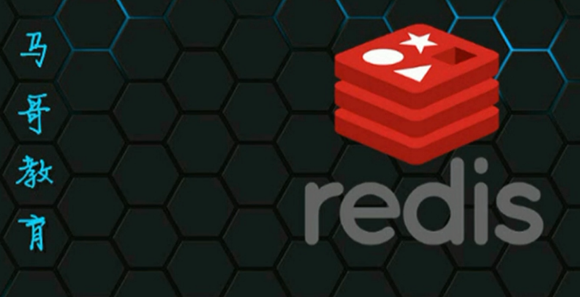
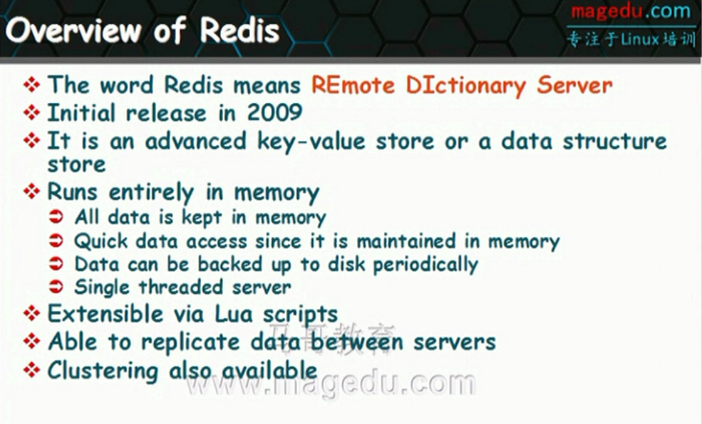

# redis基础入门

## redis简介

* 属于NoSQL技术
* 内存数据库技术，但是依然可以提供持久存储能力
* Remote Dictionary Server，数据结构远程存储功能
* 高级的key-value存储，列表、字典、hash表等
* 所有数据集都是保存在内存中，访问性能非常高，数据会周期写入到磁盘上实现持久功能
* 写入操作仅仅是为了保持重启后数据也存在，有点冗余。大部分功能都是在内存中
* 单线程服务器，所有业务一个线程？

---
