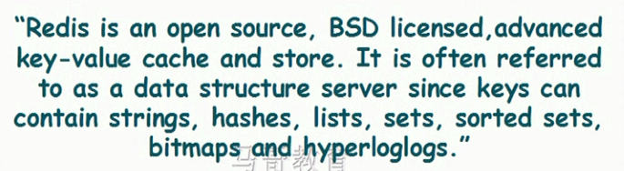
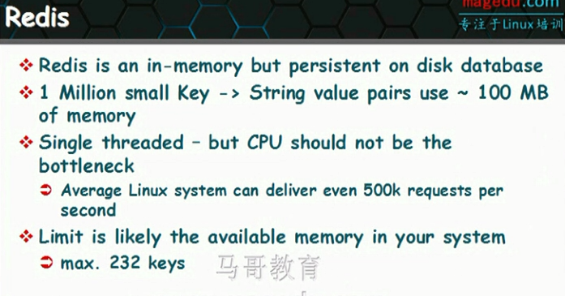
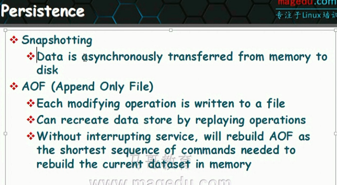
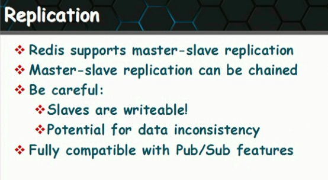
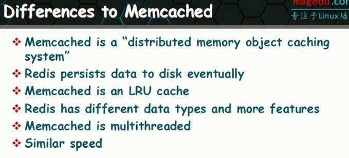
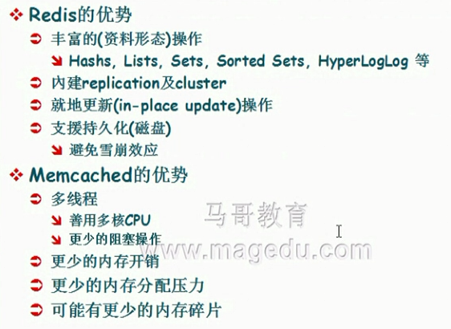
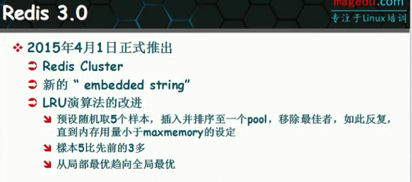
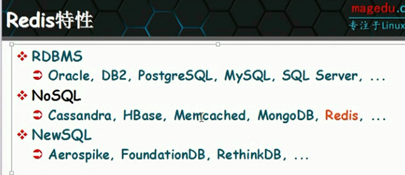
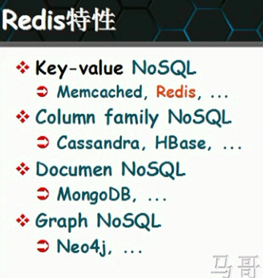

# redis基础入门


## redis简介

* 属于NoSQL技术
* 内存数据库技术，但是依然可以提供持久存储能力
* Remote Dictionary Server，数据结构远程存储功能
* 高级的key-value存储，列表、字典、hash表等
* 所有数据集都是保存在内存中，访问性能非常高，数据会周期写入到磁盘上实现持久功能
* 写入操作仅仅是为了保持重启后数据也存在，有点冗余。大部分功能都是在内存中
* 单线程服务器，所有业务一个线程？
* Clustering分布式
* 数据结构服务器
  - String
  - List
  - Hash
  - Set
  - Sorted Set
  - Zset
  - BitMaps
  - HyperLoglog






* 内存数据库，但是支持持久存储
* 一百万的键值对会使用100MB内存，对内存消耗非常小
* 单线程，CPU通常不会成为瓶颈
* 大体上每秒钟能够承受50万的并发



* 数据持久方式
  - 快照，直接转存到磁盘
  - 增加到文件后买



* 支持复制
* 支持消息队列，支持发布订阅特性



* 区别于内存对象缓存系统，redis支持更多数据类型，更多数据
* redis单线程，memecache是多线程
* 速率差不多







* 数据库存储系统大致有三类
  - NoSQL
  - NewSQL
  - RDBSQL



* NoSQL有四种流派




## 随堂笔记

```


Redis:
	KV cache and store
		in-memory
		持久化
		主从(借助于sentinel实现一定意义上的HA)
		Clustering(分布式)

	数据结构服务器：
		String, List, Hash, Set, Sorted Set, Bitmap, HyperLoglog

	存储系统有三类：
		RDBMS
		NoSQL:
			KV NoSQL：redis
			Column Family NoSQL: HBase
			Documentation NoSQL: MongoDB
			Graph NoSQL: Neo4j
		NewSQL

	Redis的组件：
		redis.io

	Redis守护进程：
		监听端口：6379/tcp

		Strings:
			SET key value [EX #] [NX|XX]
			GET
			INCR
			DECR
			EXIST

		Lists:
			LPUSH
			RPUSH
			LPOP
			RPOP
			LINDEX
			LSET

		Sets:
			SADD
			SINTER
			SUNION
			SPOP
			SISMEMBER

		Sorted Sets:
			ZADD
			ZRANGE
			ZCARD
			ZRANK

		Hashes:
			HSET
			HSETNX
			HGET
			HKEYS
			HVALS
			HDEL

		Bitmaps, HyperLogLog

	认证实现方法：
		(1) redis.conf
			requirepass PASSWORD

		(2) redis-cli
			AUTH PASSWORD

	清空数据库：
		FLUSHDB：清空当前库
		FLUSHALL：清空所有库

	事务：
		通过MULTI, EXEC, WATCH等命令实现事务功能；将一个或多个命令归并为一个操作提请服务器按顺序执行的机制；不支持回滚操作；

		MULTI：启动一个事务；
		EXEC: 执行事务；
			一次性将事务中的所有操作执行完成后返回给客户端；

		WATCH：乐观锁；在EXEC命令执行之前，用于监视指定数量键；如果监视中的某任意键数据被修改，则服务器拒绝执行事务；

	Connection相关的命令：
		AUTH
		ECHO
		PING
		QUIT
		SELECT

	Server相关的命令：
		CLIENT SETNAME connection-name
		CLIENT GETNAME
		CLIENT KILL ip:port

		CONFIG GET
		CONFIG RESETSTAT
		CONFIG SET parameter value
		CONFIG REWRITE

		DBSIZE


		BGSAVE
		SAVE
		LASTSAVE

	发布与订阅(publish/subscribe)
		频道：消息队列

		SUBSCRIBE: 订阅一个或多个队列；
		PUBLISH: 向频道发布消息；

		UNSUBSCRIBE：退订此前订阅的频道；

		PSUBSCRIBE：模式订阅

	Redis的持久化：
		RDB和AOF
			RDB: snapshot，二进制格式；按事先定制的策略，周期性地将数据保存至磁盘；数据文件默认为dump.rdb;
				客户端也可显式使用SAVA或BGSAVE命令启动快照保存机制；
					SAVE: 同步，在主线程中保存快照；此时会阻塞所有客户端请求；
					BGSAVE：异步，
			AOF：Append Only File
				记录每一次写操作至指定的文件尾部实现持久化；当redis重启时，可通过重新执行文件中的命令在内存重建数据库；
					BGREWRITEAOF：AOF文件重写；
						不会读取正在使用AOF文件，而通过将内存中的数据以命令的方式保存到临时文件中，完成之后替换原来的AOF文件；


			RDB：
				SAVE 900 1
				SAVE 300 10
				SAVE 60 10000

				stop-writes-on-bgsave-error yes
				rdbcompression yes
				rdbchecksum yes
				dbfilename dump.rdb
				dir /var/lib/redis

			AOF:
				重写过程：
					(1) redis主进程通过fork创建子进程；
					(2) 子进程根据redis内存中的数据创建数据库重建命令序列于临时文件中；
					(3) 父进程继承client的请求，并会把这些请求中的写操作继续追加至原来AOF文件；额外地，这些新的写请求还会被放置于一个缓冲队列中；
					(4) 子进程重写完成，会通知父进程；父进程把缓冲中的命令写到临时文件中
					(5) 父进程用临时文件替换老的aof文件；

				相关参数：
					appendonly no
					appendfilename "appendonly.aof"
					appendfsync {always|everysec|no}
					no-appendfsync-on-rewrite no
					auto-aof-rewrite-percentage 100
					auto-aof-rewrite-min-size 64mb

			注意：持久本身不能取代备份；还应该制定备份策略，对redis数据库定期进行备份；

		RDB与AOF同时启用：
			(1) BGSAVE和BGREWRITEAOF不会同时执行；
			(2) 在Redis服务器启动用于恢复数据时，会优先使用AOF；

	复制：
		特点：
			一个Master可以有多个Slave；
			支持链式复制；
			Master以非阻塞方式同步数据至slave；

		slave:
			> SLAVAOF MASTER_IP MASTER_PORT

		注意：如果master使用requirepass开启了认证功能，从服务器要使用masterauth <PASSWORD>来连入服务请求使用此密码进行认证；

	sentinel：
		用于管理多个redis服务实现HA；
			监控
			通知
			自动故障转移

			流言协议，投票协议

		程序：
			redis-sentinel /path/to/file.conf
			redis-server  /path/to/file.conf --sentinel

			(1) 服务器自身初始化，运行redis-server中专用于sentinel功能的代码；
			(2) 初始化sentinel状态，根据给定的配置文件，初始化监控的master服务器列表；
			(3) 创建连向master的连接；

		专用配置文件：/etc/redis-sentinel.conf
			(1) # sentinel monitor <master-name> <ip> <redis-port> <quorum>

				sentinel monitor mymaster 127.0.0.1 6379 2

			(2) sentinel down-after-milliseconds <master-name> <milliseconds>

				sentinel down-after-milliseconds mymaster 30000

			(3) sentinel parallel-syncs <master-name> <numslaves>

				sentinel parallel-syncs mymaster 1

			(4) sentinel failover-timeout <master-name> <milliseconds>

				sentinel failover-timeout mymaster 180000

 		主观下线，客观下线：
 			主观下线：一个sentinel实例判断出某节点下线；
 			客观下线：多个sentinel节点协商后判断出某节点下线；

 		专用命令：
 			SENTINEL masters
 			SENTINEL slaves <master name>
 			SENTINEL get-master-addr-by-name <master name>
 			SENTINEL reset
 			SENTINEL failover <master name>

 	Clustering：
 		分布式数据库，通过分片机制进行数据分布，clustering内的每个节点仅数据库的一部分数据；
 			每个节点持有全局元数据，但仅持有一部分数据；


作为一种基数统计算法，比如统计一个千万级别以上的访问日志文件中不同IP出现的次数，传统实现方式是把文件中的所有IP取出并存储到hash set中，计算总数即可。不过，处理海量数据的时，对内存的占用量将会特别大，因此就有了所谓的“位图法“。位图可以快速、准确地获取一个给定输入的基数。位图的基本思想是使用哈希函数把数据集映射到一个bit位，每个输入元素与bit位是一一对应。这样Hash将没有产生碰撞冲突，并减少需要计算每个元素映射到1个bit的空间。虽然Bitmap大大节省了存储空间，但当统计很高的基数或非常大的不同的数据集，它们仍然有问题。好在基数统计作为一个新兴的领域，业已出现不少开源算法，基数统计算法的思想是用准确率换取空间，准确率可以稍稍差一点点，但是可以大大的缩减占用的空间。例如，目前3个比较有代表的算法是：Java HashSet、Linear Probabilistic Counter以及一个Hyper LogLog Counter。

```
