# 网络名称空间netns用法详解

## Linux内核支持的资源隔离措施

### namespace的作用


* 假意欺骗用户，然使用者感觉自己是资源的独占者
* 用户和用户组隔离不安全，docker都不使用
* Namespace并不是Linux才推出的东西，早在很久之前，Unix上就有类似的东西，而HPUX和Solaris商用的Conatiner更是以前就有推出。而在Linux的2.6之后的版本Namespace就逐步的被加了进来。

### cgroups的作用

* cgroups主要是完成资源配置，用于实现限制被各个namespace隔离起来的资源，可以设置资源的权重，计算使用量，完成各种所需的管理任务等。
* control group是内核提供的一种机制，把一系列进程及子进程配置成不同层级，使得任务定位到某个层级与其他隔离开来。
* 把所有可用资源切割成多样化分组，并且可以递归划分。任务绑定在一个层级就可以使用当前层级任意资源，看绑定的层级。
* 把有限资源层级化，计算用量。控制资源的树状结构


## network namespace网络名称空间

### 网络名称空间的作用

* 虚拟机如何与外部通信？
* 虚拟机如何获得IP地址？
* NAT地址表怎么定义呢？会不会对其他主机产生影响？如果虚拟机IP地址一样呢？

使用网络名称空间所造成的也就是每个虚拟机的网络通信所处名称空间对其他名称空间不影响。与宿主机网络不影响。

路由层面隔离？


* 处于独立名称空间下与宿主机相互隔离不影响，与宿主机网络没有关系
* 每个虚拟机拥有一个名称空间下，就产生了在路由层面上创建的虚拟网络隔离


* 虚拟网络和物理网络的通信，通过虚拟路由发送的报文路由到物理网卡。可以直连也可以NAT
* 依然跟宿主机没有半毛钱关系，而彼此之间相互隔离
* 虚拟路由器也可以开通DHCP服务器，这个路由器工作在该名称空间下，那么只对这个名称空间产生影响，不影响其他名称空间当然也包括宿主机

### 实验测试

* 创建两个虚拟机


* centos6上在ip命令中去掉了netns功能，这就尴尬了。因此升级ip命令所在包就可以了。
* centos7上可以完整使用

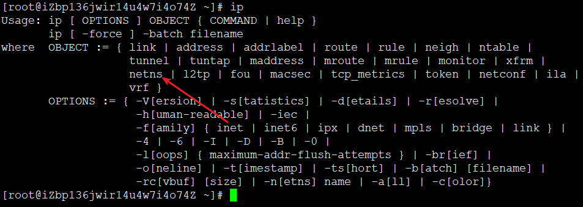

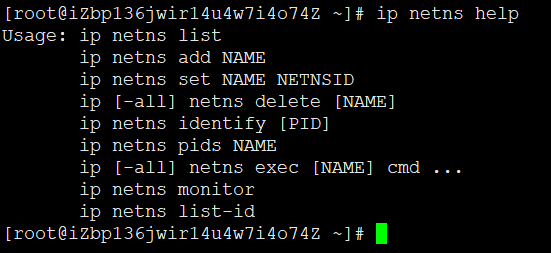

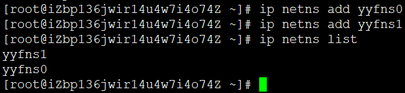

* 添加一个名称空间**ip netns add [ns namespace]**
* 删除一个名称空间**ip netns delete [ns namespace]**

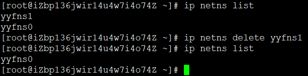

* 在名称空间内部运行程序**ip [-all] netns exec [NAME] cmd ...**
  - 名称空间相互隔离，运行程序不影响其他空间以及宿主机
  - 为嘛只有lo呢？因为本身隔离并且没有添加任何虚拟网络设备

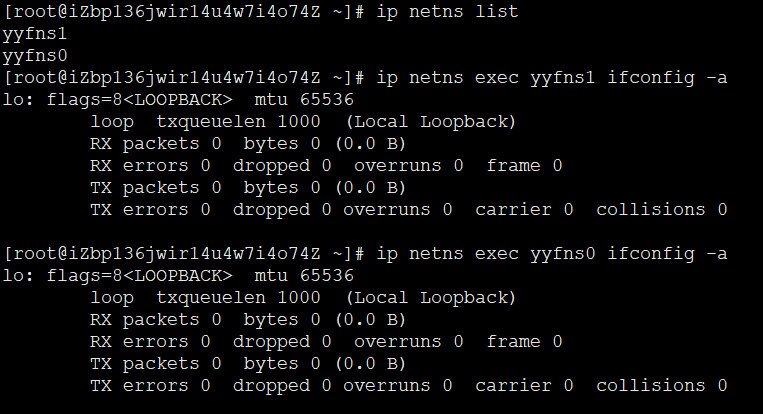

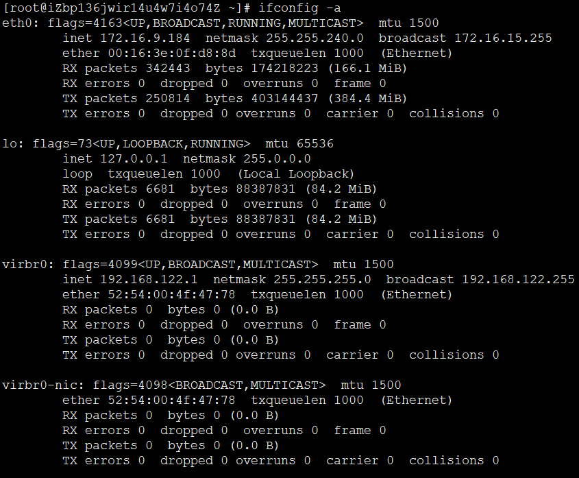

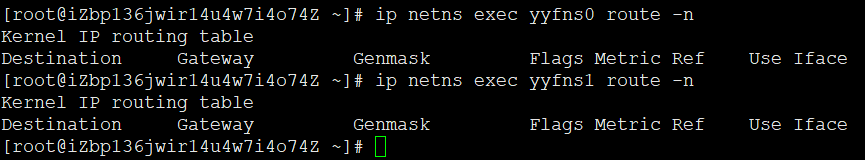

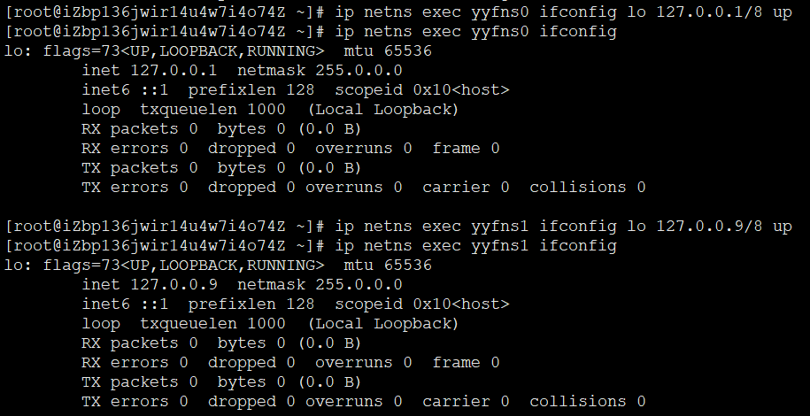

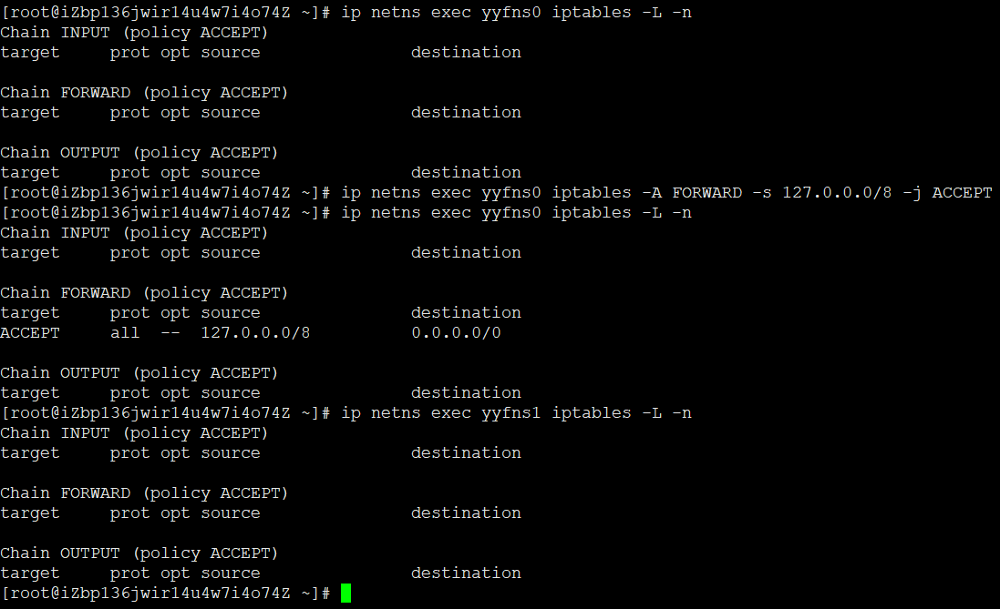

* iptables规则添加不影响，相互隔离，与主机隔离

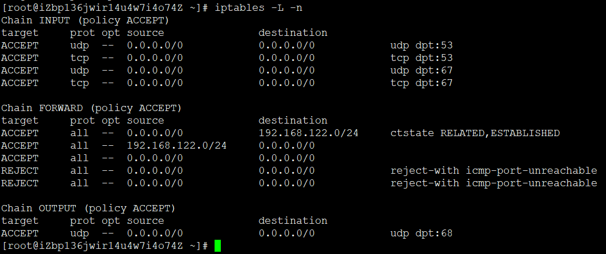

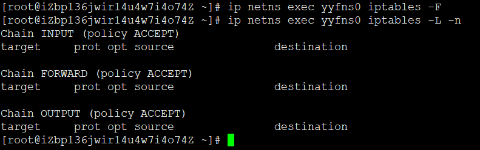

#### 物理桥的创建

* 添加物理网卡桥brctl操作

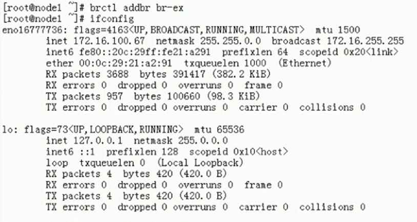

* 激活桥

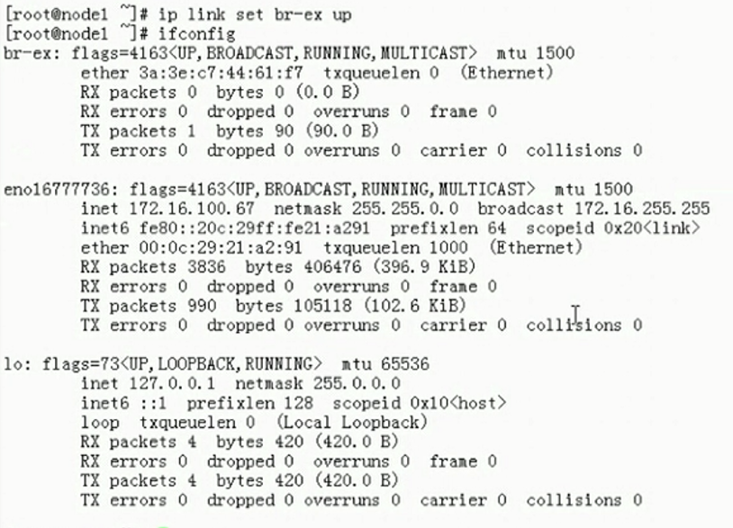

* 把物理网卡放到桥上，必须多个命令一齐键入执行

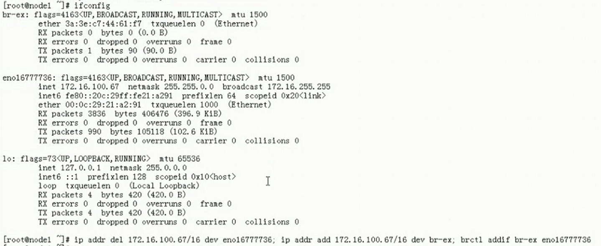

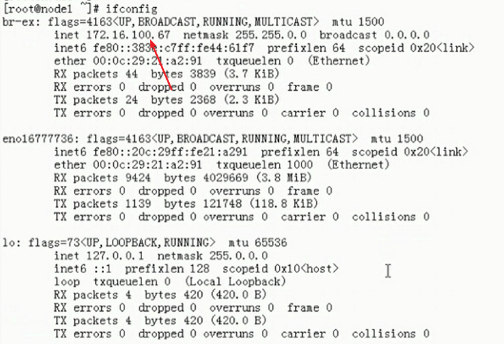

至此完成物理桥的创建

#### 虚拟网络桥的创建

* 添加桥并且激活

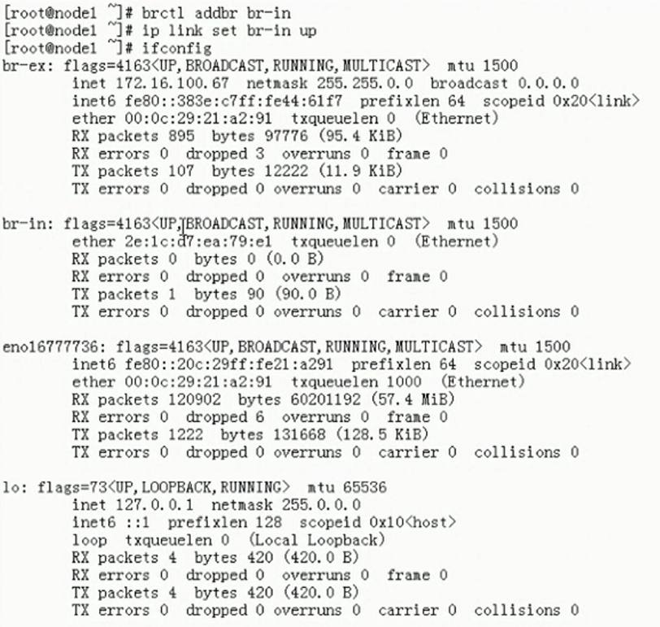

* 网络名称空间上添加一对网卡，一个在其中一个接到网络名称空间上，另一个在桥上

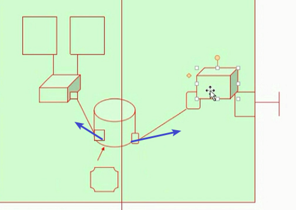

需要用到ip link命令，下面列出ip link帮助信息。

```
[root@iZbp136jwir14u4w7i4o74Z ~]# ip link help
Usage: ip link add [link DEV] [ name ] NAME
                   [ txqueuelen PACKETS ]
                   [ address LLADDR ]
                   [ broadcast LLADDR ]
                   [ mtu MTU ] [index IDX ]
                   [ numtxqueues QUEUE_COUNT ]
                   [ numrxqueues QUEUE_COUNT ]
                   type TYPE [ ARGS ]

       ip link delete { DEVICE | dev DEVICE | group DEVGROUP } type TYPE [ ARGS ]

       ip link set { DEVICE | dev DEVICE | group DEVGROUP }
	                  [ { up | down } ]
	                  [ type TYPE ARGS ]
	                  [ arp { on | off } ]
	                  [ dynamic { on | off } ]
	                  [ multicast { on | off } ]
	                  [ allmulticast { on | off } ]
	                  [ promisc { on | off } ]
	                  [ trailers { on | off } ]
	                  [ carrier { on | off } ]
	                  [ txqueuelen PACKETS ]
	                  [ name NEWNAME ]
	                  [ address LLADDR ]
	                  [ broadcast LLADDR ]
	                  [ mtu MTU ]
	                  [ netns { PID | NAME } ]
	                  [ link-netnsid ID ]
			  [ alias NAME ]
	                  [ vf NUM [ mac LLADDR ]
				   [ vlan VLANID [ qos VLAN-QOS ] [ proto VLAN-PROTO ] ]
				   [ rate TXRATE ]
				   [ max_tx_rate TXRATE ]
				   [ min_tx_rate TXRATE ]
				   [ spoofchk { on | off} ]
				   [ query_rss { on | off} ]
				   [ state { auto | enable | disable} ] ]
				   [ trust { on | off} ] ]
				   [ node_guid { eui64 } ]
				   [ port_guid { eui64 } ]
			  [ xdp { off |
				  object FILE [ section NAME ] [ verbose ] |
				  pinned FILE } ]
			  [ master DEVICE ][ vrf NAME ]
			  [ nomaster ]
			  [ addrgenmode { eui64 | none | stable_secret | random } ]
	                  [ protodown { on | off } ]

       ip link show [ DEVICE | group GROUP ] [up] [master DEV] [vrf NAME] [type TYPE]

       ip link xstats type TYPE [ ARGS ]

       ip link afstats [ dev DEVICE ]

       ip link help [ TYPE ]

TYPE := { vlan | veth | vcan | dummy | ifb | macvlan | macvtap |
          bridge | bond | team | ipoib | ip6tnl | ipip | sit | vxlan |
          gre | gretap | ip6gre | ip6gretap | vti | nlmon | team_slave |
          bond_slave | ipvlan | geneve | bridge_slave | vrf | macsec }
[root@iZbp136jwir14u4w7i4o74Z ~]#
```

* 这里veth一般成对出现，前一半后一半。
* 为了功能效果打开路由转发功能编辑/etc/sysctl.conf功能

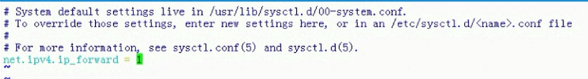


* 创建一对网卡ip  link add

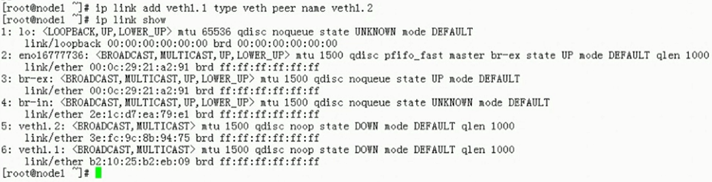

* ip link也刻意通过设定接口接到某个名称空间中。
* 一个网卡只能使用一个名称空间，要么宿主机要么客户机。但是一对的话，其实相当于一根网线的两头

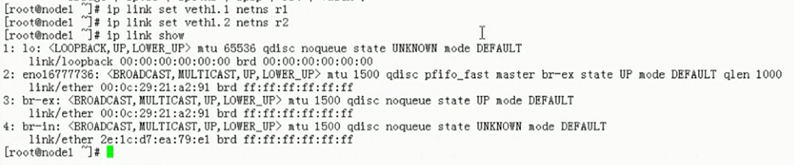

* 很神奇哦，把新增的网卡接到两个名称空间中的时候，宿主机看不到了，没错就是隔离了
* 还是那句话，一个网卡只能属于一个名称空间，要么属于宿主机要么客户机

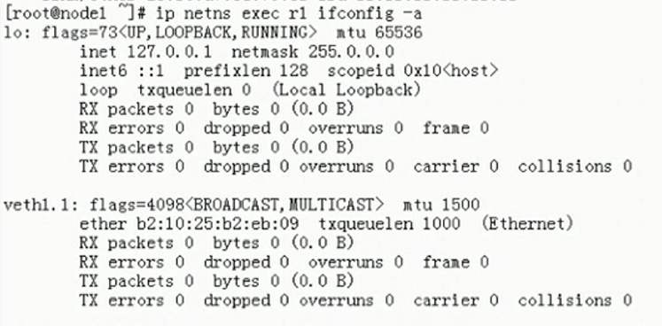

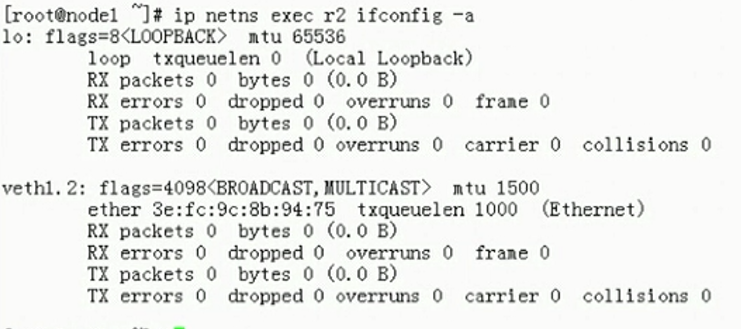

* 完美接入到名称空间，但是名称奇怪？一般都是eth0，ip link也可以修改名字，让其在不同名称空间都可以叫eth0

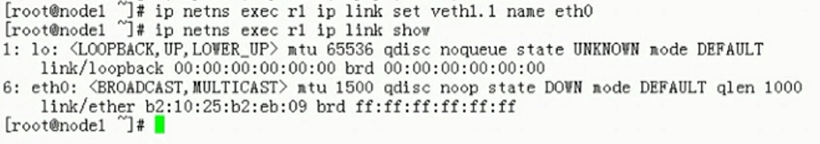

* 手动配置ip激活虚拟网卡，都可以ping通，完美

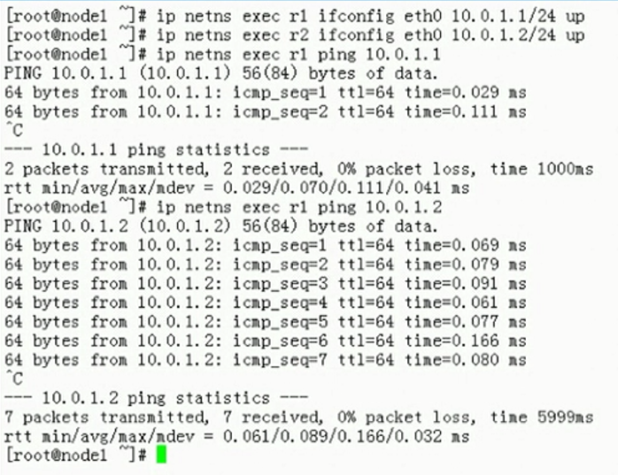

#### 虚拟路由连通名称空间虚拟机让虚拟机与外网通信

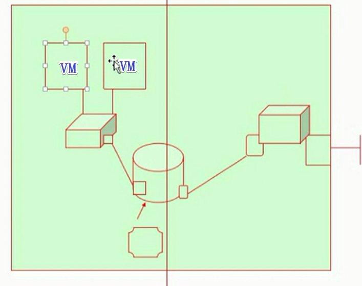

* 模拟实现的是三层网络设备功能，这就很骚气
* 但是涉及到DHCP功能那就是提供到了应用层功能
* docker其实也就是这样，更强更强大而已，控制命令直接名称空间一堆创建出来就是。
* 二层设备用的网桥，默认btctl提供的功能太简陋，可以使用openvswitch，增强版的网桥，后面演示


首先创建几个虚拟机，用qemu创建

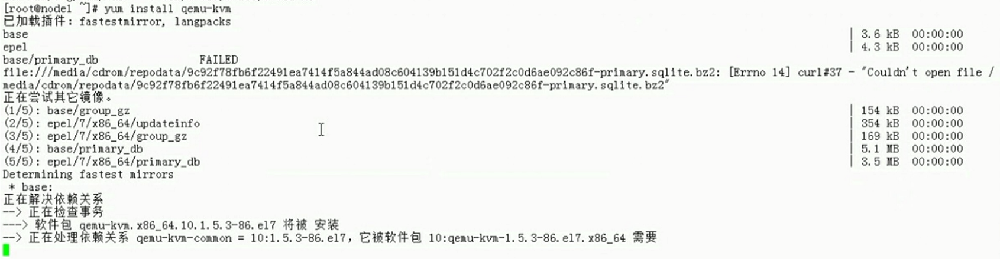

* 装载kvm内核模块


* 服务器搞一波精简系统镜像不用麻烦重新搞

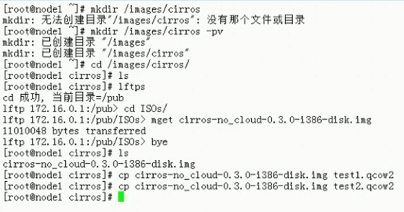


* 创建管理网桥脚本

```
[root@master1 ~]# vim /etc/qemu-ifup

#!/bin/bash
#
bridge=br-in

if [ -n "$1"  ]; then
    ip link set $1 up
    brctl addif $bridge $1
    [ $? -eq 0 ] && exit 0 || exit 1
else
    echo "Error,no interface specified"
    exit 1
fi

[root@master1 ~]# chmod +x /etc/qemu-ifup

[root@master1 ~]# ln -sv /usr/libexec/qemu-kvm /usr/bin/
```

* 启动第一个虚拟机

```
[root@master1 ~]# qemu-kvm -m 128 \
                  -smp 1 -name vm1  \
                  -drive file=/images/cirros/test1.qcow2,if=virtio,media=disk \
                  -net nic,macaddr=52:54:00:aa:bb:cc \
                  -net tap,ifname=vif1.0,script=/etc/qemu-ifup \
                  --nographic # 设定不用vnc，直接在当前终端显示
```

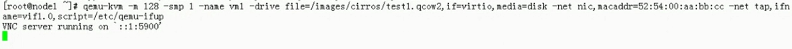

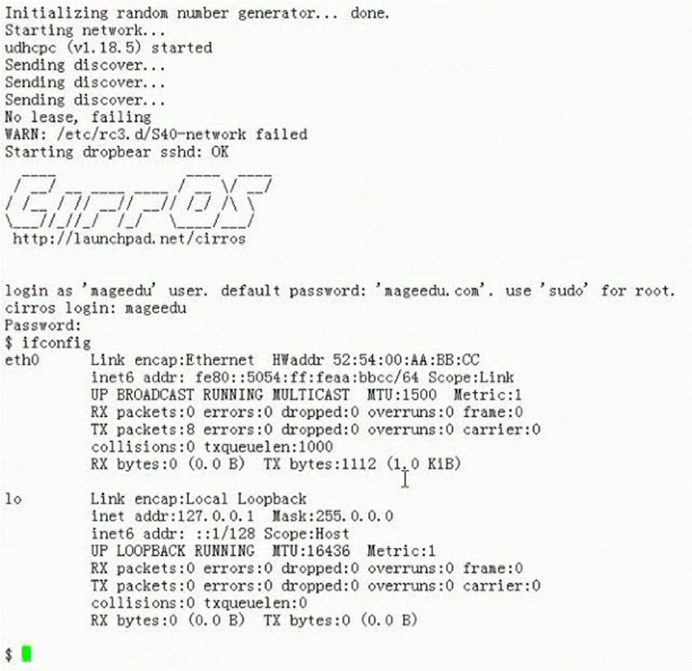


* 换一个控制台启动第二个虚拟机

```
[root@master1 ~]# qemu-kvm -m 128 \
                  -smp 1 -name vm1  \
                  -drive file=/images/cirros/test1.qcow2,if=virtio,media=disk \
                  -net nic,macaddr=52:54:00:aa:bb:dd \
                  -net tap,ifname=vif1.0,script=/etc/qemu-ifup \
                  --nographic # 设定不用vnc，直接在当前终端显示
```

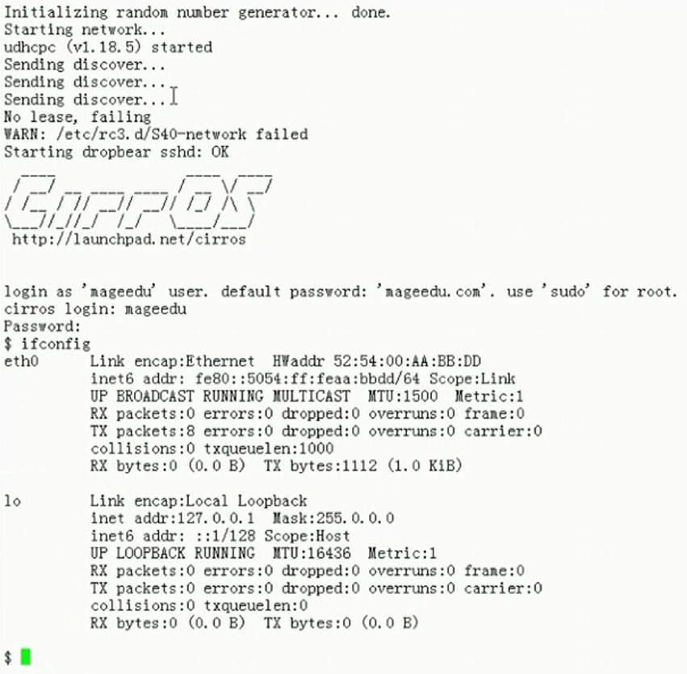

* 在宿主机查看桥

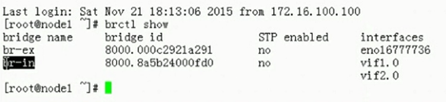

两个虚拟机启动并且另一半自动接到桥上

* 清空原先的名称空间

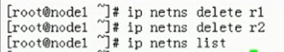

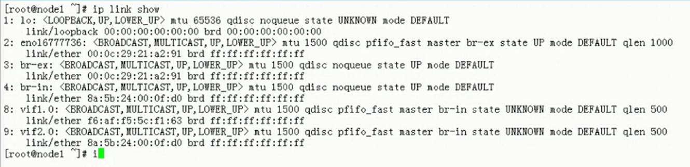

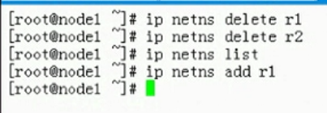

创建一个新的名称空间r1

* 添加路由器和桥的接口

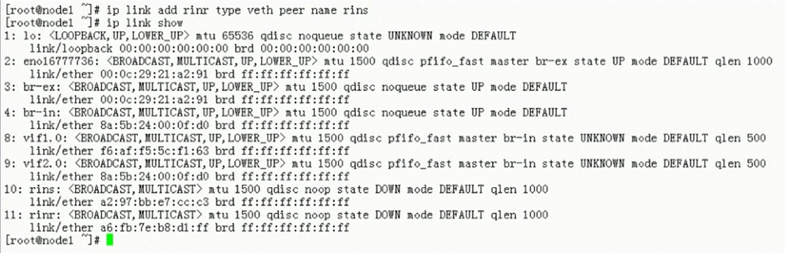


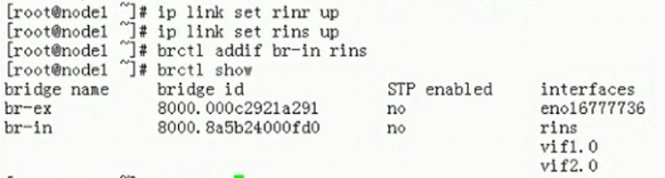

启动激活接口

* 将接口放到名称空间中

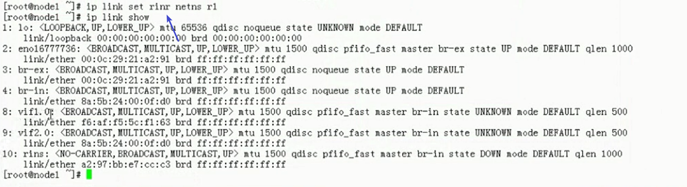

rinir在宿主机中就看不到了，已经放到了r1的名称空间了

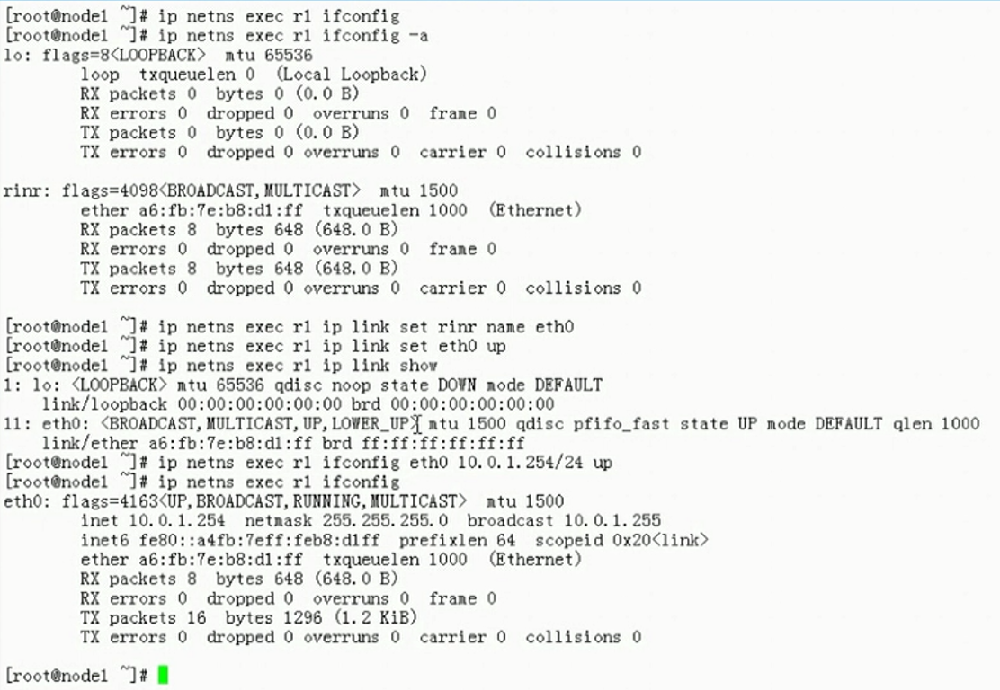


* 配置两个虚拟机地址均在10网段

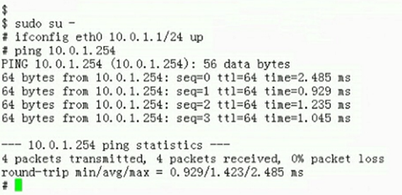

配置网关也指向它


另外一台虚拟机也这样

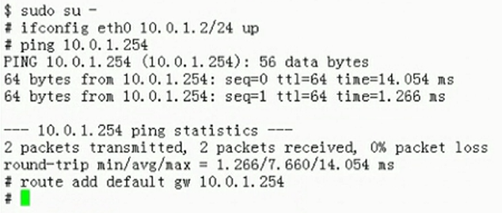

* 继续添加路由器另一半接到物理网卡生成的桥

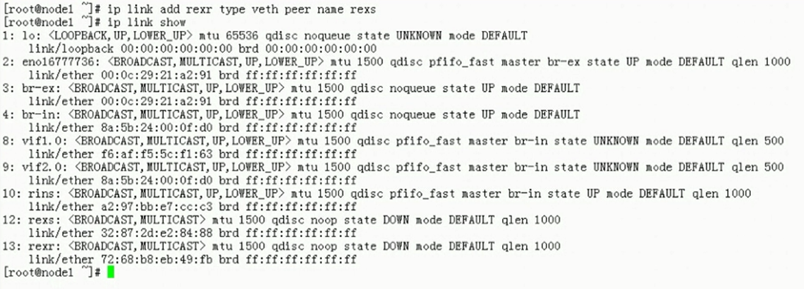

虚拟网卡放到物理桥上

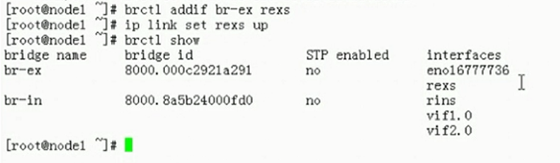

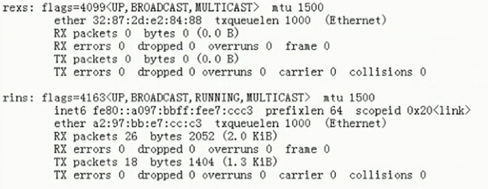

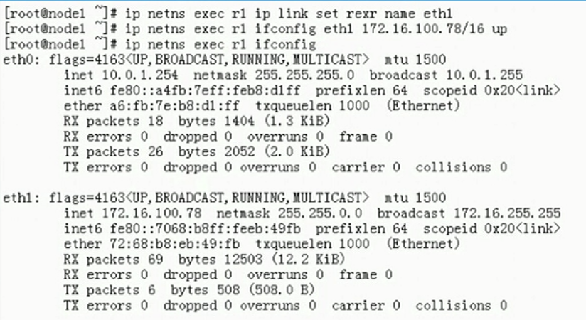

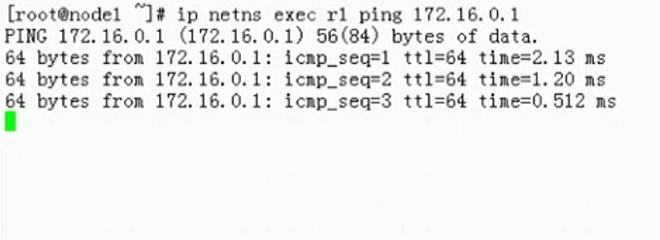

* 可以ping通到r1的接口，但是ping不通外面，因为外面不知道里面的情况，回不来
* **必须要在宿主机打开路由转发才能创建网络名称空间不然不能用，所以第一步已经开启路由转发了。**

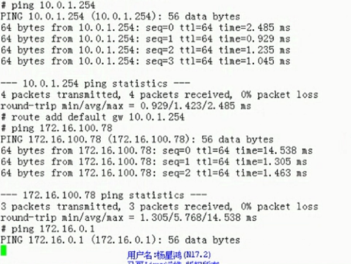

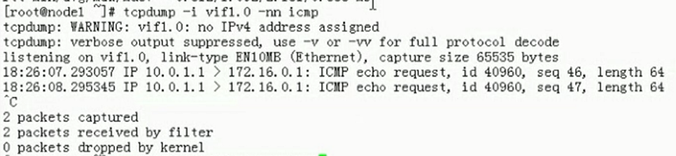

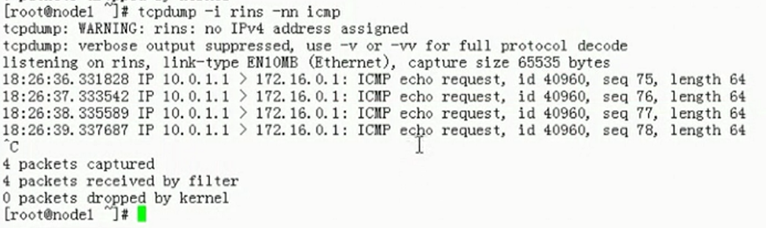

* 分别不通接口处抓包测试

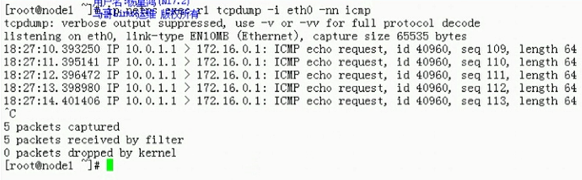

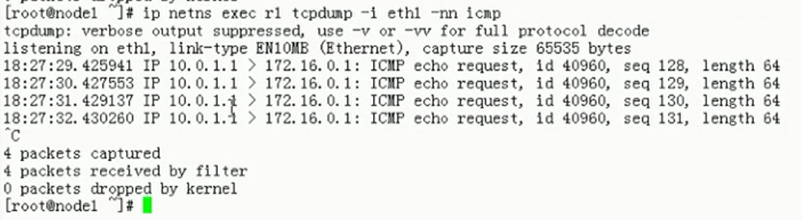


* 都能抓到包说明就是能通信，但是回不来就是了

#### SNAT规则让包回馈可接受


* ping通，完美


* 如果新增一个桥，新增虚拟机，那么又要添加一波规则才行，snat规则


#### 如何让两个物理主机上的虚拟机进行通信？


* 这其实难度非常大的，内网主机没有发布出来，都是内网ip，怎么相互通信？
* 因为都是隐藏在NAT之后的主机


* 如果使用桥接，那是很直接粗暴但是不靠谱的方式
* 后面讲openvswitch会解决这个问题


#### 启用DHCP服务

借用 dnsmasq 功能


虽然dnsmasq没有指定路由


* 在宿主机上也可以看到dnsmasq但是运行在r1环境下，跟宿主机没有半毛钱关系，只是可以看到进程而已


----
