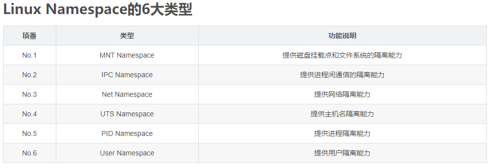
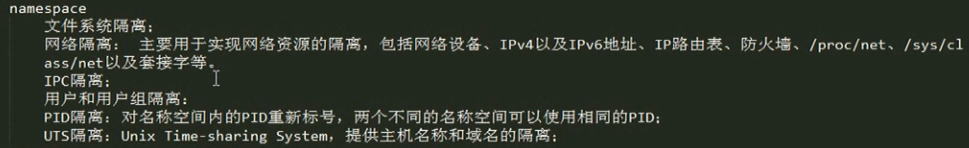
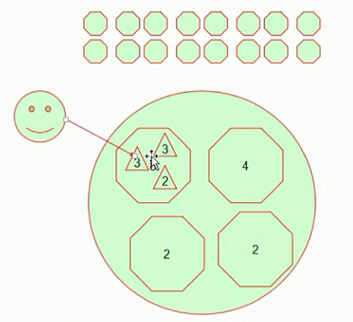
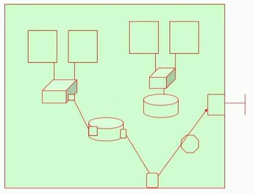
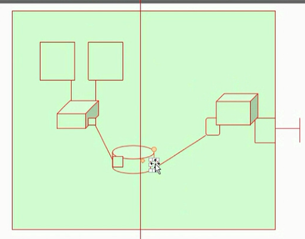
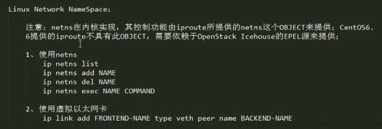

# 网络名称空间netns用法详解

## Linux内核支持的资源隔离措施

### namespace的作用

* 假意欺骗用户，然使用者感觉自己是资源的独占者
* 用户和用户组隔离不安全，docker都不使用
* Namespace并不是Linux才推出的东西，早在很久之前，Unix上就有类似的东西，而HPUX和Solaris商用的Conatiner更是以前就有推出。而在Linux的2.6之后的版本Namespace就逐步的被加了进来。

### cgroups的作用

* cgroups主要是完成资源配置，用于实现限制被各个namespace隔离起来的资源，可以设置资源的权重，计算使用量，完成各种所需的管理任务等。
* control group是内核提供的一种机制，把一系列进程及子进程配置成不同层级，使得任务定位到某个层级与其他隔离开来。
* 把所有可用资源切割成多样化分组，并且可以递归划分。任务绑定在一个层级就可以使用当前层级任意资源，看绑定的层级。
* 把有限资源层级化，计算用量。控制资源的树状结构

## network namespace网络名称空间

### 网络名称空间的作用

* 虚拟机如何与外部通信？
* 虚拟机如何获得IP地址？
* NAT地址表怎么定义呢？会不会对其他主机产生影响？如果虚拟机IP地址一样呢？

使用网络名称空间所造成的也就是每个虚拟机的网络通信所处名称空间对其他名称空间不影响。与宿主机网络不影响。

路由层面隔离？

* 处于独立名称空间下与宿主机相互隔离不影响，与宿主机网络没有关系
* 每个虚拟机拥有一个名称空间下，就产生了在路由层面上创建的虚拟网络隔离

* 虚拟网络和物理网络的通信，通过虚拟路由发送的报文路由到物理网卡。可以直连也可以NAT
* 依然跟宿主机没有半毛钱关系，而彼此之间相互隔离
* 虚拟路由器也可以开通DHCP服务器，这个路由器工作在该名称空间下，那么只对这个名称空间产生影响，不影响其他名称空间当然也包括宿主机

### 实验测试

* 创建两个虚拟机

* centos6上在ip命令中去掉了netns功能，这就尴尬了。因此升级ip命令所在包就可以了。
* centos7上可以完整使用

----
