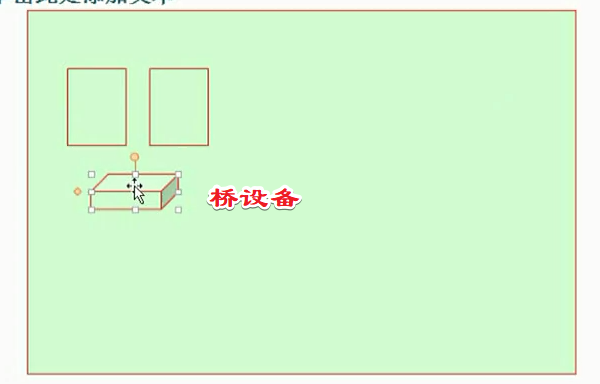
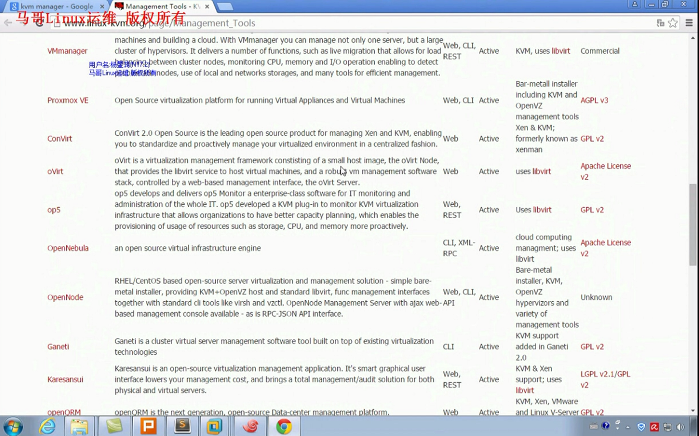
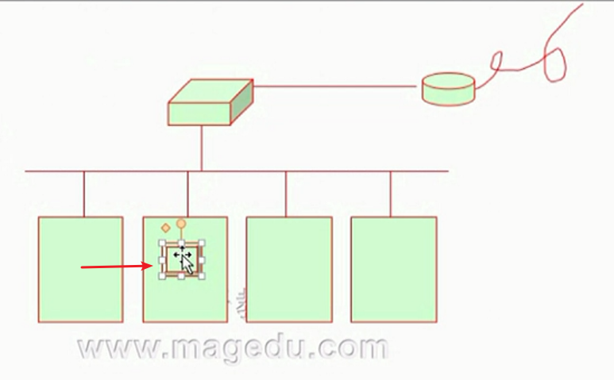
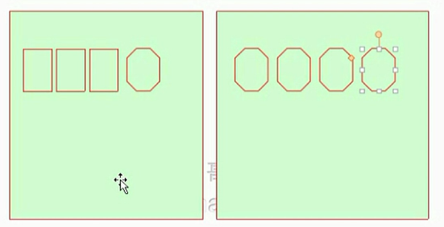
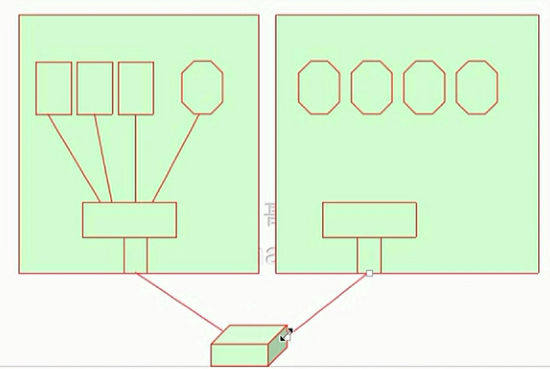

# 网络虚拟化技术基础

## 回顾

**Xen支持CPU的半虚拟化，但是KVM不支持。而对于IO的半虚拟化这两者都支持** 

* 半虚拟化
  * CPU半虚拟化：Xen支持，但是KVM不支持
    * 必须要修改内核
  * I/O半虚拟化：
    * Xen：net、blk
    * KVM：virtio实现
* 完全虚拟化
* 内存虚拟化
  * 影子页表：纯软件使用，效率低
  * 硬件辅助内存虚拟化
    * EPT技术-嵌套页表技术
    * RVI技术-快速虚拟索引
* 网络虚拟化
  * 桥接类型-主要指物理桥
  * 隔离-虚拟通道，构建内部专用通信虚拟网络-虚拟交换机-网桥设备
  * 路由模型：把隔离模型的接口，放到虚拟路由中
  * NAT模型
  * OpenvSwitch开源项目

如果仅虚拟机设备间通信，那么构建一个桥设备就是了

如果想跟外部设备通信怎么做？

粗暴的可以直接桥接到物理桥，细致的可以通过路由设备转发。

如果物理服务器有多台，但凡能够虚拟化的设备都用来搭建，那么虚拟机一般要用来作为外部可以访问的目标，如何指定物理服务器启动虚拟机，并且拥有什么系统，磁盘哪里来，如何通过外网访问内部虚拟机？如果不同节点物理节点内的虚拟机直接相互通信该怎么操作？这一切都成了问题。一旦跨越多个物理服务器了怎么办？

一旦遇到这样的需求场景了该怎么办？

<http://www.linux-kvm.org/page/Management_Tools>

列出了大部分虚拟化管理工具

## 网络I/O如何进行灵活分配？

如果从第一个节点切换到第二个节点要保持网络配置不变怎么操作？这就要求每个物理节点都要有共同的桥才行，同样物理网络属性的配置。

如果虚拟机实例是一个隔离模型呢？VLAN

如果是路由网络呢？同样的物理网络配置以及每个虚拟路由设备开启路由转发才行

如果是NAT模型呢？都有类似转发规则，每一个节点都要这么配置。

网络配置要保持一样才行

部门服务器如何做隔离？

要想隔离首先应该保证物理上就是隔离的，也就是说中间必须增加一个路由器，彼此之间才能做到交叉访问。

## VLAN虚拟局域网技术

---

---
