<!-- TOC depthFrom:1 depthTo:6 withLinks:1 updateOnSave:1 orderedList:0 -->

- [网络虚拟化技术进阶1](#网络虚拟化技术进阶1)

  - [网络虚拟化](#网络虚拟化)


  - [OpenVSwitch](#openvswitch)
    - [OpenVSwitch特性](#openvswitch特性)
    - [OpenVSwitch组成部分](#openvswitch组成部分)

  - [ovs-vsctl](#ovs-vsctl)

    - [ovs-vsctl命令的使用](#ovs-vsctl命令的使用)

<!-- /TOC -->
# 网络虚拟化技术进阶1


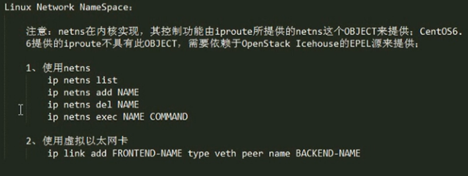

## 网络虚拟化

复杂的网络虚拟化网络
* network namespace网络名称空间
* OpenVSwitch

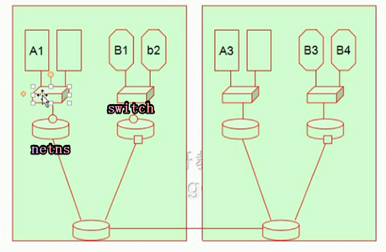


## OpenVSwitch

### OpenVSwitch特性

* 基于C语言研发
* 支持KVM、Xen等大部分虚拟化技术
* 支持多种协议，802.1q协议，支持trunk、access
* 支持网卡绑定技术，NIC Bonding，将多个网卡组合起来作为虚拟网卡使用，实现负载均衡的工作效果
* 支持NetFlow、sFlow
* 支持Qos配置及策略，Quality of Service
* 支持GRE通用路由分装，支持VxLan技术
* 支持OpenFlow技术，支持其扩展
* 支持Linux内核高性能转发功能
* 如果不考虑性能，其功能不亚于一款高级硬件交换机

### OpenVSwitch组成部分


* **ovs-vswitchd**：OVS守护进程是OVS的核心部件，实现交换功能，和Linux内核兼容模块一起，实现基于流的交换（flow-based switching）。它和上层 controller 通信遵从 OPENFLOW 协议，它与 ovsdb-server 通信使用 OVSDB 协议，它和内核模块通过netlink通信，它支持多个独立的 datapath（网桥），它通过更改flow table 实现了绑定和VLAN等功能。
* **ovsdb-server**：OVS轻量级的数据库服务器，用于整个OVS的配置信息，包括接口，交换内容，VLAN 等等。ovs-vswitchd 根据数据库中的配置信息工作。它于 manager 和 ovs-vswitchd 交换信息使用了OVSDB(JSON-RPC)的方式。
* ovs-dpctl：一个工具，用来配置交换机内核模块，可以控制转发规则。
* **ovs-vsctl**：主要是获取或者更改ovs-vswitchd的配置信息，此工具操作的时候会更新ovsdb-server中的数据库。
* ovs-appctl：主要是向OVS守护进程发送命令的，一般用不上。 a utility that sends commands to running Open vSwitch daemons (ovs-vswitchd)
* ovsdbmonitor：GUI工具来显示ovsdb-server中数据信息。（Ubuntu下是可以使用apt-get安装，可以远程获取OVS数据库和OpenFlow的流表）
* ovs-controller：一个简单的OpenFlow控制器
* ovs-ofctl：用来控制OVS作为OpenFlow交换机工作时候的流表内容。
* ovs-pki：OpenFlow交换机创建和管理公钥框架；
* ovs-tcpundump：tcpdump的补丁，解析OpenFlow的消息；
* brocompat.ko : Linux bridge compatibility module
* openvswitch.ko : Open vSwitch switching datapath


参考链接<https://blog.csdn.net/tantexian/article/details/46707175>

## 准备实验

* 安装openvswitch

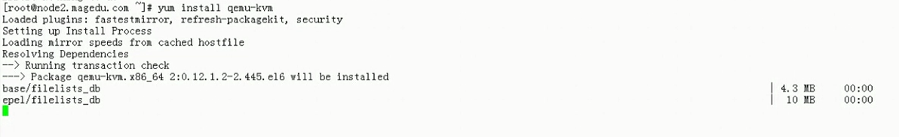

* 使用ovs-vsctl添加桥

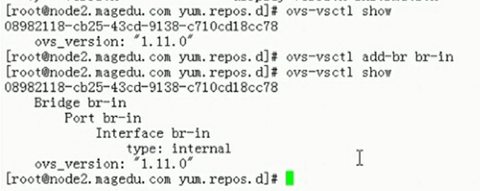

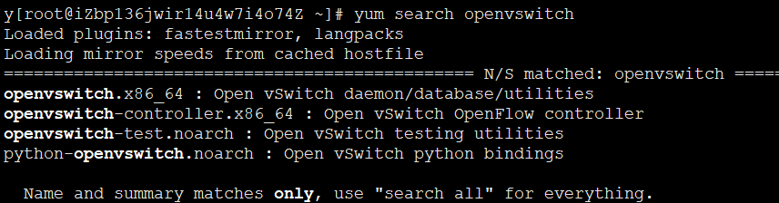


* 安装qemu-kvm,下载相应镜像

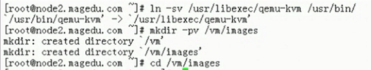


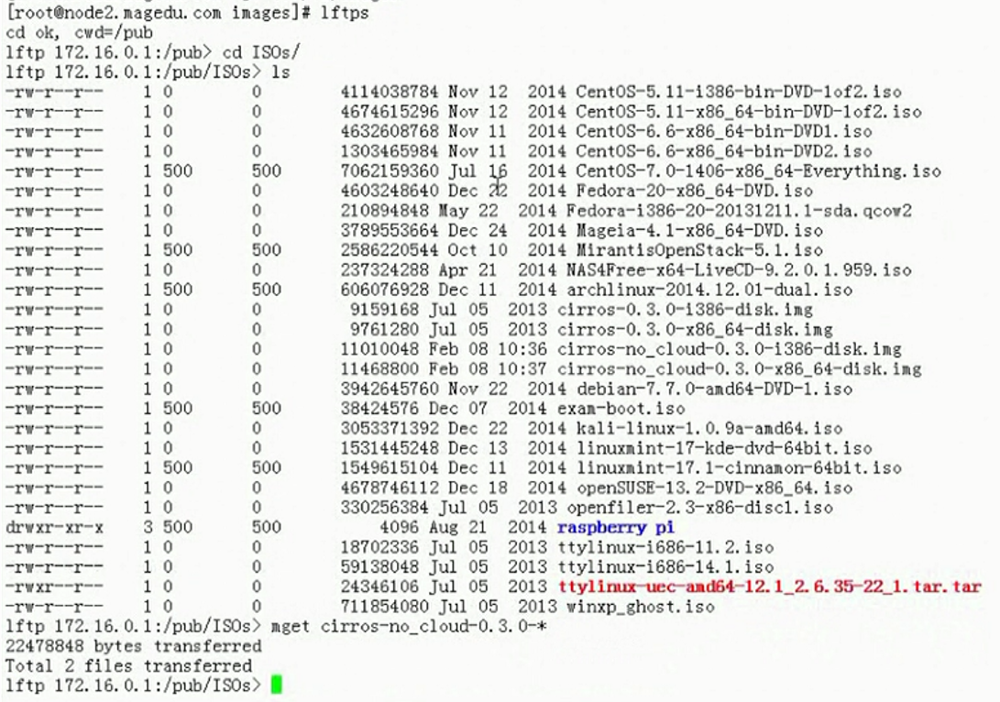

创建网卡启动脚本 /etc/if-up,赋予可执行权限

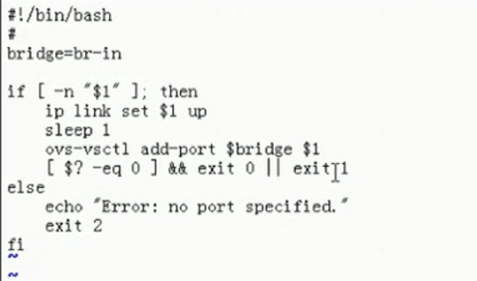

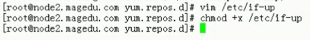

启动虚拟机


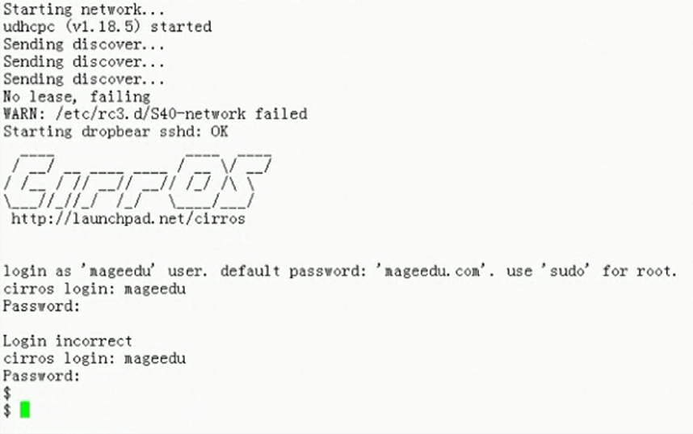

关闭虚拟机方法，直接杀进程

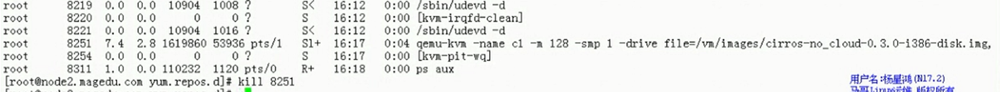

关闭虚拟机最好有一个down-script脚本，不然ovs不会自动移除接口

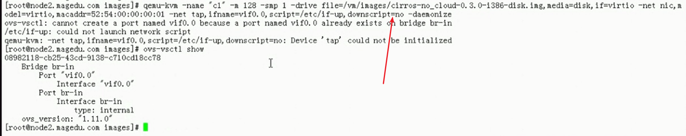

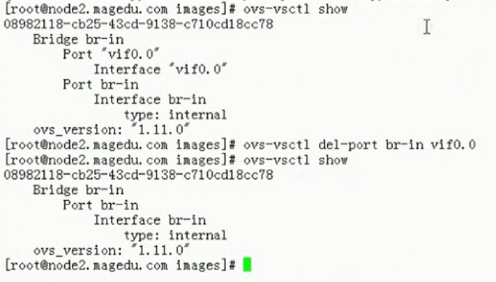

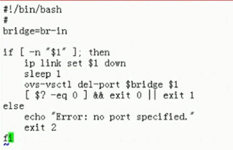

必要的时候也可以把桥删掉

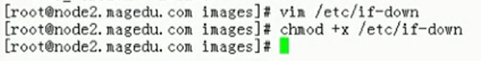

也可以使用vncviewer去查看虚拟机

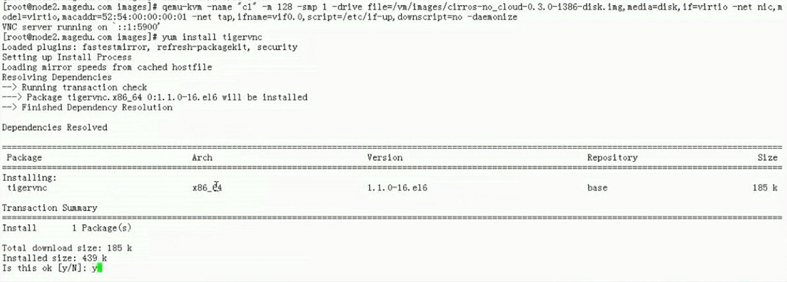

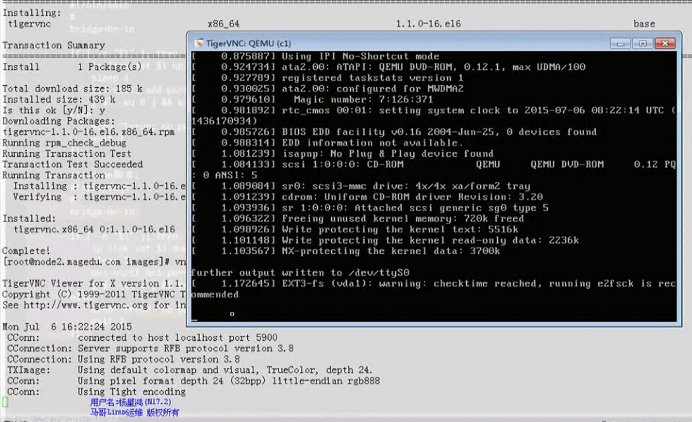

查看ovs端口

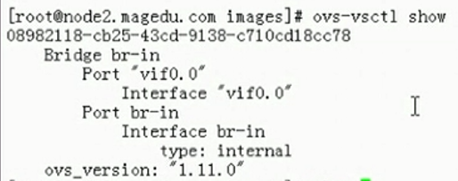

继续启动第二个虚拟机

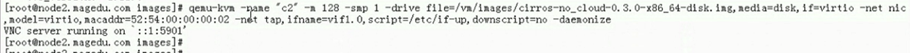

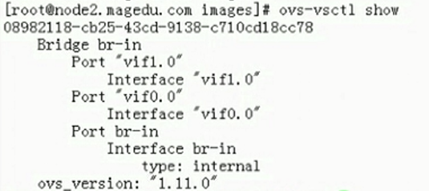

可以看到自动添加了另一个虚拟接口

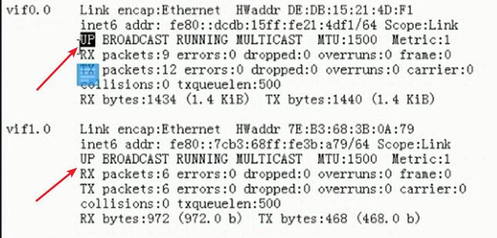

两个虚拟机实例相互通信

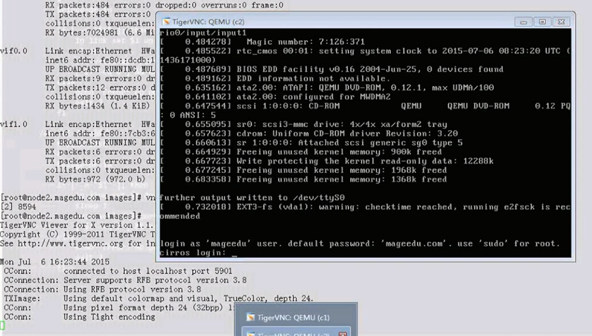

检测虚拟机直接通信

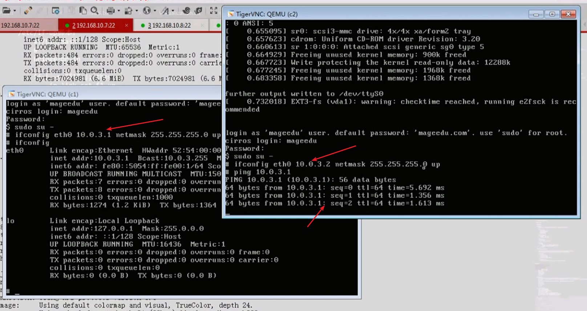

很明显看到相互之间可以通信。但是如何隔离虚拟机之间通信？

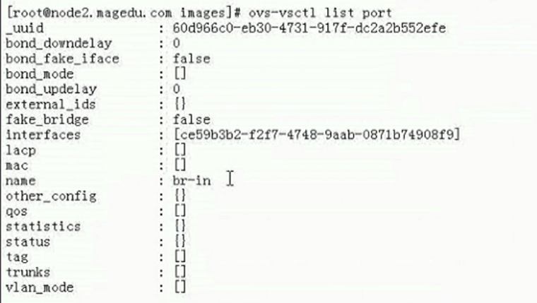

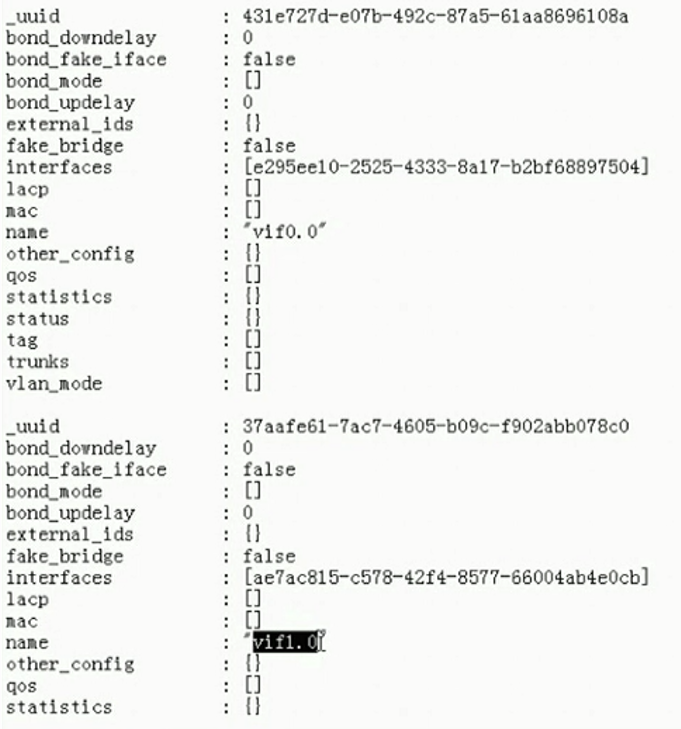

ovs查看所有接口。**VLAN是基于MAC而不是ip的**

VLAN划分方式有几种？基于MAC、基于ip的，以及基于tag，基于端口加标签的方式

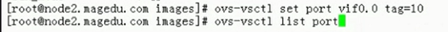

设定vif0.0的tag=10

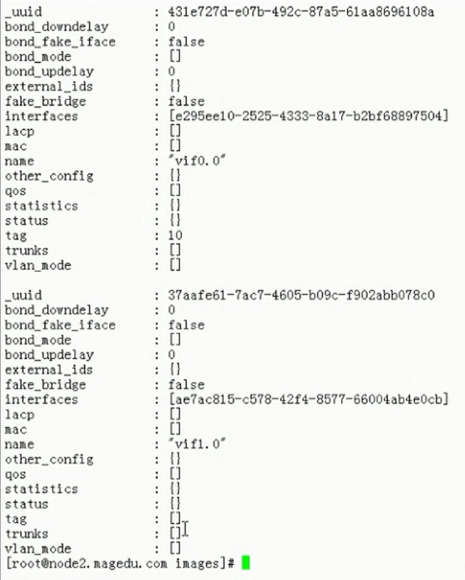

这个时候相互能ping通？

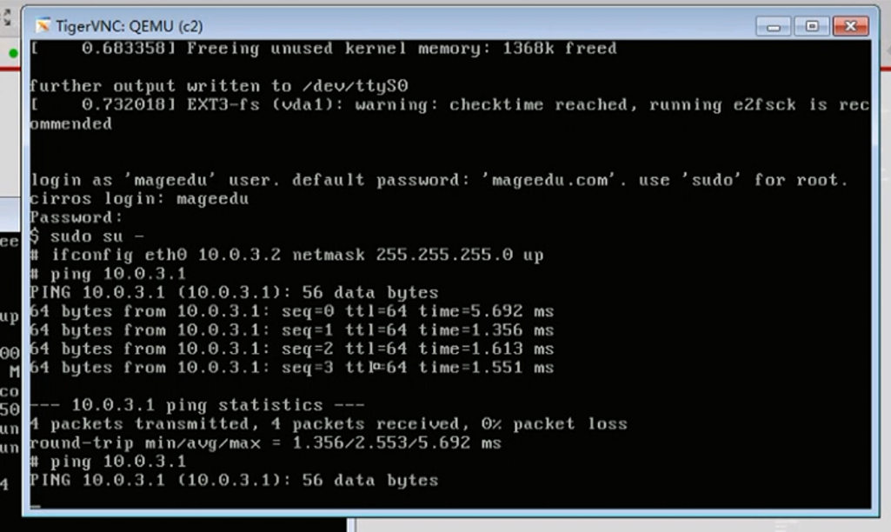

不可能ping通，一个有tag，一个没有tag默认就是VLAN 0 ，说明处于不同VLAN。即使地址处于一个网段也不能相互通信。

如果设定tag一样，会怎样?

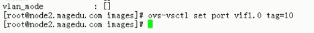

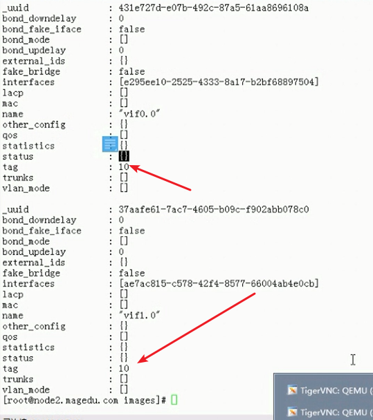

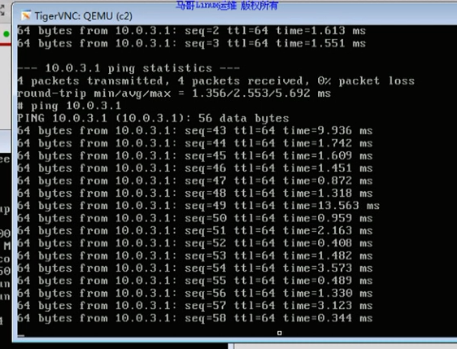

这就是是否处于一个VLAN的作用和意义。


跨交换机VLAN实现，怎么玩？这个需要交换机支持才行

首先修改虚拟机网络脚本

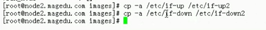

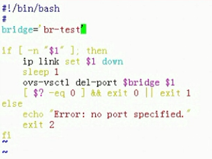

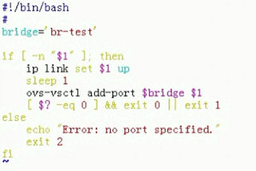

添加一个新的桥

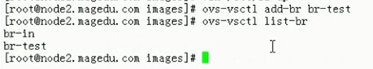

创建一个新的磁盘镜像

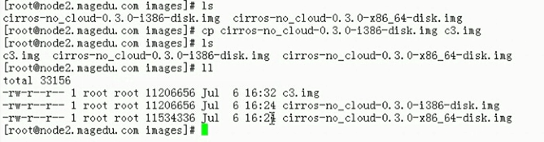

启动新的虚拟机实例


## ovs-vsctl

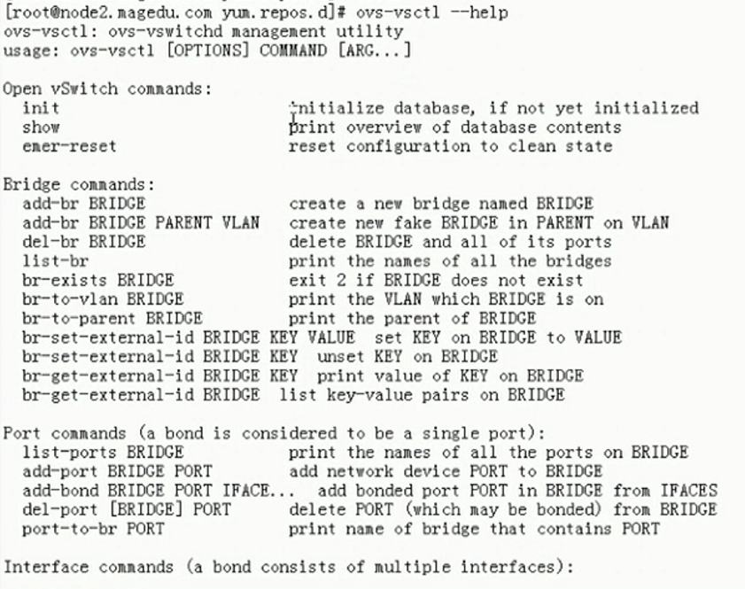


```
[root@iZbp136jwir14u4w7i4o74Z ~]# ovs-vsctl  --help
ovs-vsctl: ovs-vswitchd management utility
usage: ovs-vsctl [OPTIONS] COMMAND [ARG...]

Open vSwitch commands:
  init                        initialize database, if not yet initialized
  show                        print overview of database contents
  emer-reset                  reset configuration to clean state

Bridge commands:
  add-br BRIDGE               create a new bridge named BRIDGE
  add-br BRIDGE PARENT VLAN   create new fake BRIDGE in PARENT on VLAN
  del-br BRIDGE               delete BRIDGE and all of its ports
  list-br                     print the names of all the bridges
  br-exists BRIDGE            exit 2 if BRIDGE does not exist
  br-to-vlan BRIDGE           print the VLAN which BRIDGE is on
  br-to-parent BRIDGE         print the parent of BRIDGE
  br-set-external-id BRIDGE KEY VALUE  set KEY on BRIDGE to VALUE
  br-set-external-id BRIDGE KEY  unset KEY on BRIDGE
  br-get-external-id BRIDGE KEY  print value of KEY on BRIDGE
  br-get-external-id BRIDGE  list key-value pairs on BRIDGE

Port commands (a bond is considered to be a single port):
  list-ports BRIDGE           print the names of all the ports on BRIDGE
  add-port BRIDGE PORT        add network device PORT to BRIDGE
  add-bond BRIDGE PORT IFACE...  add bonded port PORT in BRIDGE from IFACES
  del-port [BRIDGE] PORT      delete PORT (which may be bonded) from BRIDGE
  port-to-br PORT             print name of bridge that contains PORT

Interface commands (a bond consists of multiple interfaces):
  list-ifaces BRIDGE          print the names of all interfaces on BRIDGE
  iface-to-br IFACE           print name of bridge that contains IFACE

Controller commands:
  get-controller BRIDGE      print the controllers for BRIDGE
  del-controller BRIDGE      delete the controllers for BRIDGE
  set-controller BRIDGE TARGET...  set the controllers for BRIDGE
  get-fail-mode BRIDGE       print the fail-mode for BRIDGE
  del-fail-mode BRIDGE       delete the fail-mode for BRIDGE
  set-fail-mode BRIDGE MODE  set the fail-mode for BRIDGE to MODE

Manager commands:
  get-manager                print the managers
  del-manager                delete the managers
  set-manager TARGET...      set the list of managers to TARGET...

SSL commands:
  get-ssl                     print the SSL configuration
  del-ssl                     delete the SSL configuration
  set-ssl PRIV-KEY CERT CA-CERT  set the SSL configuration

Switch commands:
  emer-reset                  reset switch to known good state

Database commands:
  list TBL [REC]              list RECord (or all records) in TBL
  find TBL CONDITION...       list records satisfying CONDITION in TBL
  get TBL REC COL[:KEY]       print values of COLumns in RECord in TBL
  set TBL REC COL[:KEY]=VALUE set COLumn values in RECord in TBL
  add TBL REC COL [KEY=]VALUE add (KEY=)VALUE to COLumn in RECord in TBL
  remove TBL REC COL [KEY=]VALUE  remove (KEY=)VALUE from COLumn
  clear TBL REC COL           clear values from COLumn in RECord in TBL
  create TBL COL[:KEY]=VALUE  create and initialize new record
  destroy TBL REC             delete RECord from TBL
  wait-until TBL REC [COL[:KEY]=VALUE]  wait until condition is true
Potentially unsafe database commands require --force option.

Options:
  --db=DATABASE               connect to DATABASE
                              (default: unix:/var/run/openvswitch/db.sock)
  --no-wait                   do not wait for ovs-vswitchd to reconfigure
  --retry                     keep trying to connect to server forever
  -t, --timeout=SECS          wait at most SECS seconds for ovs-vswitchd
  --dry-run                   do not commit changes to database
  --oneline                   print exactly one line of output per command

Logging options:
  -v, --verbose=[SPEC]    set logging levels
  -v, --verbose           set maximum verbosity level
  --log-file[=FILE]       enable logging to specified FILE
                          (default: /var/log/openvswitch/ovs-vsctl.log)
  --no-syslog             equivalent to --verbose=vsctl:syslog:warn

Active database connection methods:
  tcp:IP:PORT             PORT at remote IP
  ssl:IP:PORT             SSL PORT at remote IP
  unix:FILE               Unix domain socket named FILE
Passive database connection methods:
  ptcp:PORT[:IP]          listen to TCP PORT on IP
  pssl:PORT[:IP]          listen for SSL on PORT on IP
  punix:FILE              listen on Unix domain socket FILE
PKI configuration (required to use SSL):
  -p, --private-key=FILE  file with private key
  -c, --certificate=FILE  file with certificate for private key
  -C, --ca-cert=FILE      file with peer CA certificate

Other options:
  -h, --help                  display this help message
  -V, --version               display version information
```

### ovs-vsctl命令的使用

* show:查看ovsdb配置内容查看
* add-br BRIDGENAME:添加桥设备
* list-br:显示所有已经定义的桥
* del-br:删除桥
* add-port BRIDGENAME PORT:将PORT添加至指定的桥
* list-ports BRIDGENAME:显示指定桥上所有端口PORT


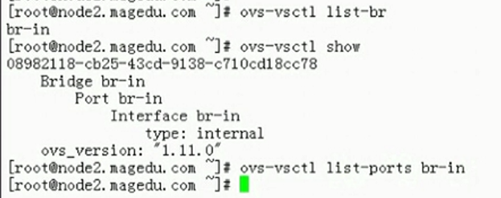


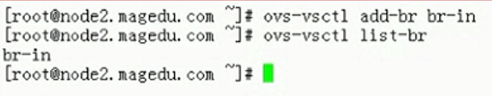

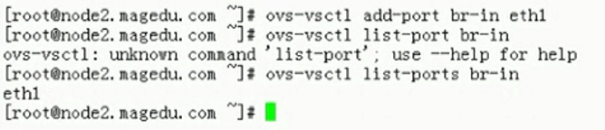

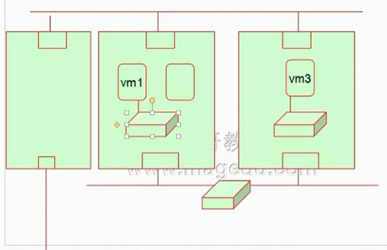

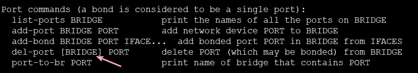

* 一个端口只能属于一个桥，所以指定了端口，桥的名称可以省略

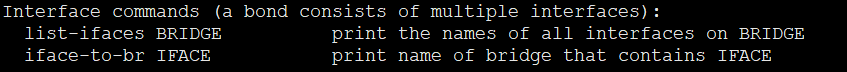

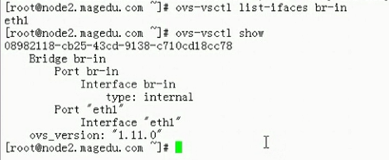

* 接口属于端口，一个端口可以配置多个接口

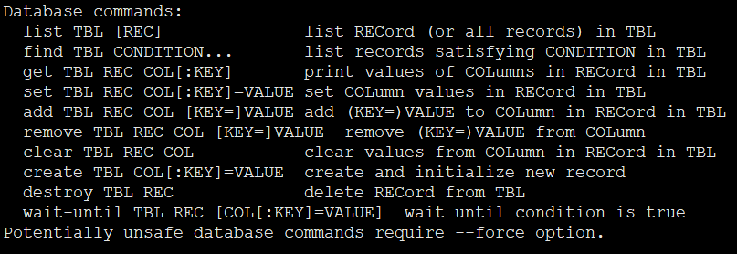

* 端口有端口表，接口有接口表

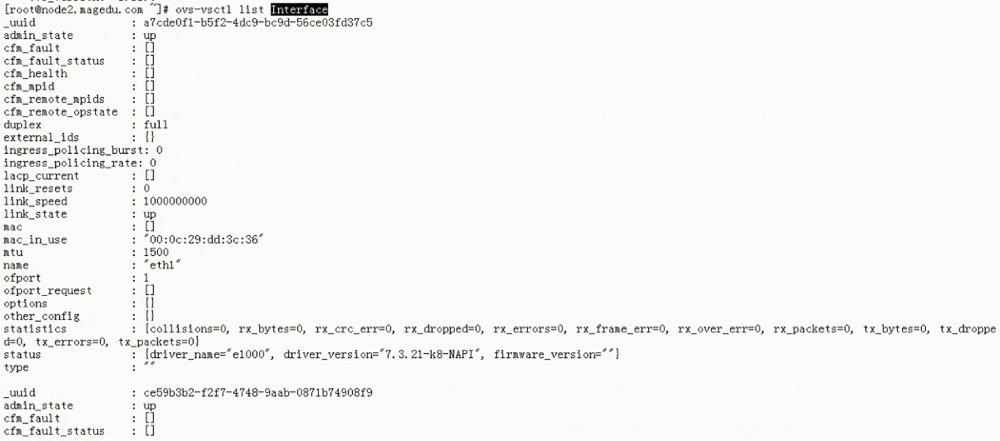

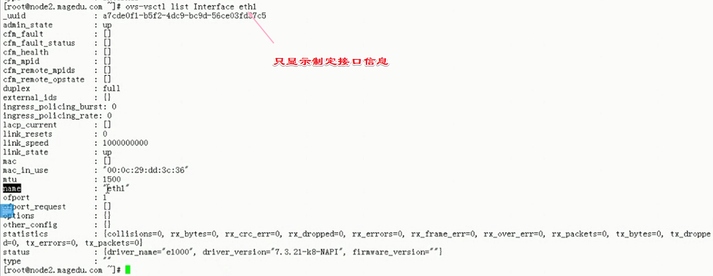

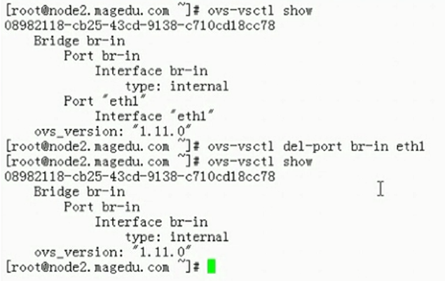


---
